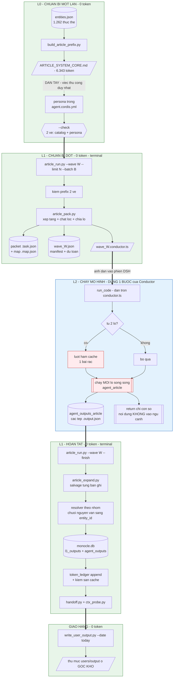
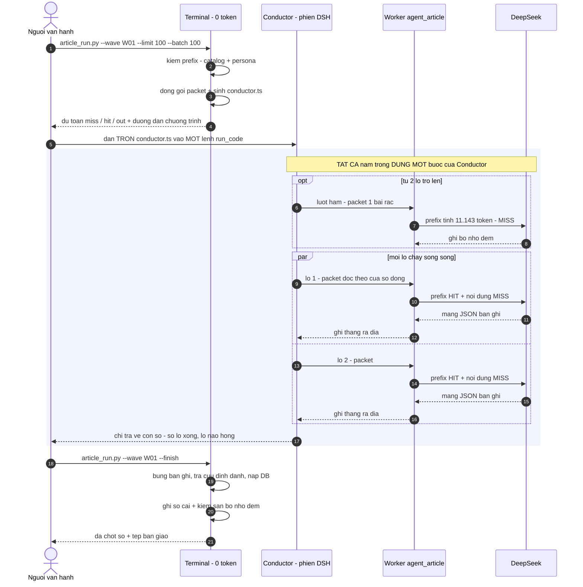
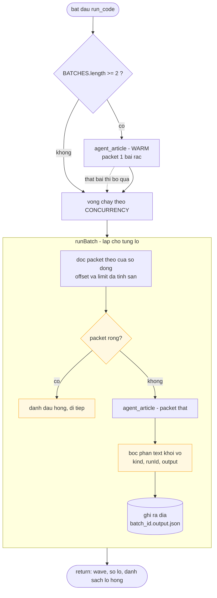
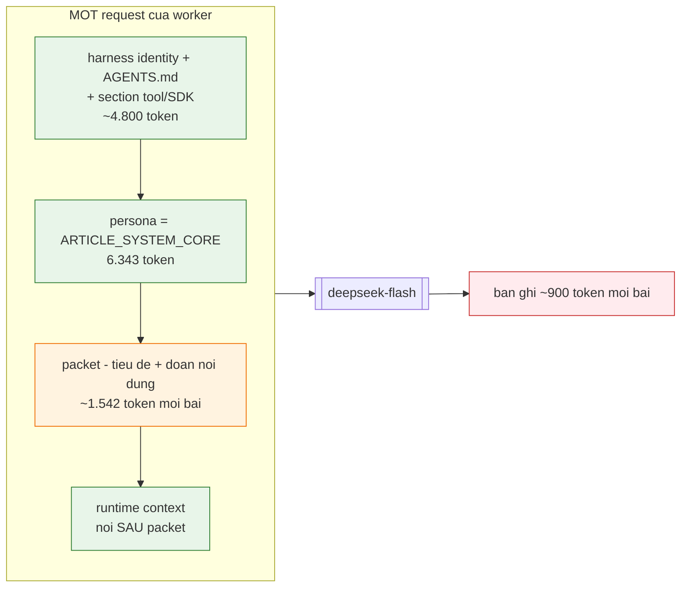
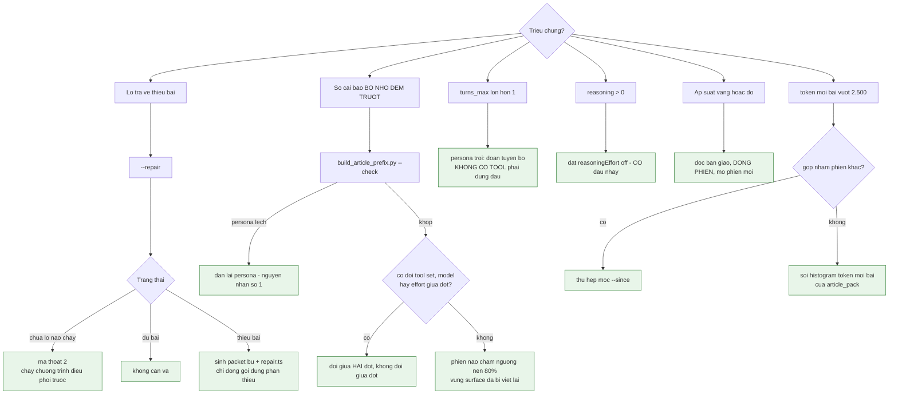

# Lưu đồ vận hành — Article Lane

|  |  |
| --- | --- |
| Lập | 2026-09-21 |
| Mô tả | Toàn bộ quy trình agent sau đợt tối ưu bộ nhớ đệm 21/09 |
| Cách chạy | [`RUNBOOK-article-lane.md`](RUNBOOK-article-lane.md) — tệp này giải thích **vì sao**, runbook nói **gõ gì** |
| Việc tay trên DSH | [`DSH-VIEC-THU-CONG.md`](DSH-VIEC-THU-CONG.md) |
| Thiết kế gốc | `plans/20260918-1651-article-lane-unified/plan.md` |

> Nhãn trong lưu đồ để **không dấu** theo đúng quy ước sẵn có của kho (`project/docs/design/*`). Phần diễn giải quanh lưu đồ vẫn có dấu đầy đủ.

---

## 0. Ba vùng chi phí — đọc lưu đồ theo vùng, không theo bước

Mọi lưu đồ dưới đây tô theo **ai trả tiền**, vì đó là thứ quyết định kiến trúc:

| Ký hiệu | Vùng | Chi phí | Ai chạy |
| --- | --- | --- | --- |
| 🟩 | **Terminal** — script Python | **0 token** | Anh gõ lệnh, máy làm |
| 🟦 | **Phiên DSH** — Conductor | ~50–200 token mỗi **bước** | Mô hình điều phối |
| 🟥 | **Worker** — `agent_article` | ~1.550 vào + ~900 ra **mỗi bài** | Mô hình xử lý |
| ⬜ | **Người** | — | Quyết định, không thao tác |

Nguyên tắc chi phối toàn bộ thiết kế: **chi phí phiên điều phối tỉ lệ với số BƯỚC, không tỉ lệ với số bài.** Vì vậy cả một đợt trăm bài được nén vào **đúng một bước** của Conductor.

---

## 1. Toàn cảnh một đợt

**Điều đáng chú ý nhất trong lưu đồ này:** hai khối xanh lá kẹp lấy một khối xanh dương rất mỏng. Mọi việc cơ học — đọc dữ liệu, chắt lọc, chia lô, tra cứu định danh, nạp cơ sở dữ liệu, tính tiền — nằm ở vùng 0 token. Mô hình chỉ làm đúng phần không code hoá được: **nhận diện thực thể và xử lý nội dung**.

---

## 2. Trình tự thời gian — ai gọi ai

Ba điều bất biến mà trình tự này bảo vệ:

1. **Kết quả của worker không bao giờ đi qua ngữ cảnh của Conductor.** Dưới chế độ `ptc`, chỉ thứ chương trình `return` mới vào ngữ cảnh — nên một đợt để lại dưới 100 token. Đổi sang `native` là mỗi lô đổ ~30.000 token JSON vào phiên cha, tức làm sống lại đúng lớp đốt token mà cả kiến trúc này chữa.
2. **Worker xong trong đúng một bước.** Nó không có tool nào, nên không tích luỹ kết quả tool, nên không có lịch sử để gửi lại.
3. **Lượt hâm đi trước, không phải lô đầu.** Bộ nhớ đệm chỉ được ghi khi có một request thật đi qua — nhưng request ấy không cần mang trăm bài.

---

## 3. Bên trong chương trình điều phối

Ba chi tiết trong lưu đồ này đều là **vết sẹo của sự cố thật**, không phải thiết kế thừa:

- **Đọc theo cửa sổ dòng.** Công cụ đọc của DSH cắt ở 2.000 ký tự mỗi dòng, 51.200 byte và 2.000 dòng mỗi lần gọi. Lô 100 bài nặng ~348 KB nên phải phân trang 7–8 lần. Các lần đọc ấy nằm **trong cùng một chương trình** nên không sinh thêm bước nào của mô hình.
- **Bóc lớp vỏ trước khi ghi.** Công cụ gọi agent trả về `{kind, runId, output:[{type,text}]}`. Ghi thẳng cả đối tượng ấy ra đĩa thì bộ bung bản ghi đọc nhầm lớp vỏ thành một bản ghi rác — đúng thứ đã xảy ra với các tệp `_cNN` của W1 và W2.
- **Chỉ `return` con số.** Mọi thứ khác ở lại trong chương trình.

---

## 4. Vòng đời token của một lô — tiền đi đâu

Thứ tự trên **không phải do dự án sắp** — DSH đã dựng sẵn đúng chiều tối ưu cho bộ nhớ đệm: phần tĩnh ở đầu, ảnh chụp runtime nối **sau** packet như một thông điệp người dùng, và `dsh-time-context` không được mount nên không có đồng hồ nào chen vào giữa.

**Giá ba rổ, off-peak, USD trên 1 triệu token:**

| Rổ | Đơn giá | So với rổ rẻ nhất |
| --- | ---: | ---: |
| Đầu vào trúng cache | 0,003 | 1× |
| Đầu vào mới | 0,15 | **50×** |
| Đầu ra | 0,60 | **200×** |

**Hệ quả xếp hạng đòn bẩy — đo trên số thật của W2:**

| | Token | Chi phí | Tỷ trọng |
| --- | ---: | ---: | ---: |
| Đầu ra | 162.703 | $0,0976 | **62%** |
| Đầu vào mới | 360.365 | $0,0541 | 34% |
| Đầu vào trúng cache | 1.723.520 | $0,0052 | 3,3% |

Hai kết luận đi kèm nhau, bỏ một cái là hiểu sai:

- Tiền tố tĩnh **chỉ đáng 1,4%** hoá đơn ở cỡ lô 100 bài. Nó không phải cần gạt tiết kiệm.
- Nhưng nếu không có cache, 1,72 triệu token tái dùng của W2 bị tính giá mới: hoá đơn thành **$0,410 thay vì $0,157**. Cache là **bảo hiểm** cho những lượt lặp bước và những lần chạy lại.

---

## 5. Cây quyết định khi có sự cố

---

## 6. Ranh giới ba lớp — luật không được vi phạm

```mermaid
flowchart LR
  subgraph MAY["MAY LAM - 0 token"]
    M1["doc va chat loc noi dung"]
    M2["xep tang uu tien"]
    M3["chia lo"]
    M4["tra chuoi nguyen van sang entity_id"]
    M5["bung trich dan theo chi so"]
    M6["cham cong nghiem thu"]
    M7["do token va tinh tien"]
  end

  subgraph LLM["LLM LAM - khong code hoa duoc"]
    N1["nhan dien thuc the tu ngu canh"]
    N2["tom tat va rut luan diem"]
    N3["ham y thi truong"]
    N4["sac thai va do khan"]
    N5["chon doan lam chung cu"]
  end

  subgraph NGUOI["NGUOI LAM"]
    H1["duyet plan va ADR"]
    H2["chon uu tien va lich chay"]
    H3["dan persona vao preset"]
    H4["xu ly bat thuong"]
  end

  MAY -.->|"packet"| LLM
  LLM -.->|"ban ghi gon"| MAY
  NGUOI -.->|"lenh dot"| MAY
```

Hai luật hai chiều, và cả hai đều từng bị vi phạm:

- **Code không được quyết định thay LLM.** Trần chắt lọc 900 token từng bỏ **46% nội dung nghiệp vụ** trước khi mô hình kịp đọc — tức code đang chọn hộ mô hình được đọc gì. Đã tắt.
- **LLM không được làm thay code.** Không đọc tệp, không tra danh mục, không tự chấm nghiệm thu, không phát định danh chuẩn. Vệt 845 nghìn token ngày 17/09 là hậu quả của việc agent tự đi dò `entities.json`: riêng việc đó chiếm 53% nội dung của cả vệt.

---

## 7. Bản đồ lệnh và tệp

| Lệnh | Sinh ra | Đọc vào |
| --- | --- | --- |
| `build_article_prefix.py` | `data/prefix/ARTICLE_SYSTEM_CORE.md` + `.meta.json` | `entities.json`, `taxonomy.json` |
| `build_article_prefix.py --check` | — | tệp prefix + `persona` trong preset |
| `article_run.py --wave W` | `article_W_NN.task.json`, `.map.json`, `wave_W.json`, `wave_W.conductor.ts` | `monocle.db`, gói tầng bạc |
| *chương trình điều phối* | `agent_outputs_article/*.output.json` | packet trên đĩa |
| `article_run.py --wave W --repair` | `*_rNN.task.json`, `wave_W.repair.ts` | packet gốc + đầu ra đã có |
| `article_run.py --wave W --finish` | bản ghi trong `monocle.db`, dòng `token_ledger`, `HANDOFF-*.md` | đầu ra của lô, checkpoint phiên DSH |
| `pipeline_radar.py token --wave W` | — | `harness.db` + checkpoint phiên |
| `estimate_wave.py --wave W` | — | manifest + `harness.db` |
| `write_user_output.py --date today` | `users/output/...` ở **gốc kho** | `monocle.db` |

---

## 8. Những gì đợt 21/09 đã đổi trong lưu đồ này

| Chỗ trong lưu đồ | Trước | Sau |
| --- | --- | --- |
| §1 khối `CHK` | `--check` chỉ so tệp với danh mục | So **hai vế**, thêm vế persona ↔ tệp |
| §3 nhánh `WARM` | Lô đầu chạy một mình để ghi cache | Lượt hâm tí hon; đợt một lô không hâm |
| §1 khối `P2` | Thứ tự bài phụ thuộc kế hoạch truy vấn | Tất định, kèm băm packet |
| §4 khối tiền tố | Dự toán chỉ đếm persona 6.343 | Đếm cả phần harness: **11.143** |
| §1 khối `LED` | Chỉ ghi số | Thêm **sàn cache** `hit ≥ tiền tố × (số phiên − 1)` |
| §7 `radar token` | Nhân định mức chết 450 / 1.470 | Đọc sổ cái và checkpoint thật |
| §5 nhánh `--repair` | Chưa chạy lần nào cũng báo "không cần vá" | Phân biệt ba trạng thái |
| §1 khối `LED` — sàn cache | Đếm mọi phiên như một worker | Đếm **lượt gọi worker** đọc từ mô tả đợt |
| §7 `radar token --date` | So ngày máy với mốc UTC của sổ cái | Đổi ngày máy thành khoảng UTC trước khi tra |

Chi tiết số đo và lý do: `plans/20260918-1651-article-lane-unified/plan.md` §17.
