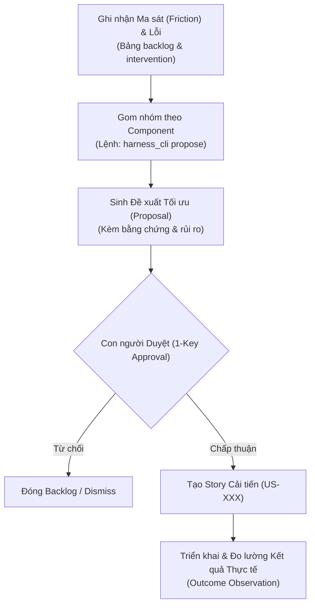

# IMPROVEMENT_PROTOCOL.md — Giao thức Tự Cải tiến Khép kín (H5)

Tài liệu này định nghĩa quy trình **Máy tự đề xuất cải tiến — Người duyệt 1 thao tác — Đo lường kết quả thực tế** (Self-Improvement Loop).

---

## 1. Sơ đồ Vòng lặp Tự Cải tiến (Closed Loop)

---

## 2. Nguyên tắc Bất biến

1. **Tuyệt đối không Auto-Apply:** Mọi đề xuất thay đổi chính sách, schema hoặc workflow của Harness **bắt buộc phải có sự phê duyệt của con người**. Máy không được phép tự động sửa code hoặc rule của chính mình mà không có kiểm soát.
2. **Đề xuất dựa trên Bằng chứng Thực nghiệm (Evidence-Based):** Một đề xuất chỉ được sinh ra khi có ít nhất $\ge 2$ bản ghi ma sát hoặc lỗi thực tế cùng chỉ về một component trong bảng `backlog`.
3. **Đo lường Kết quả Thực tế (Outcome Loop):** Sau khi giải quyết đề xuất, Agent phải ghi lại kết quả đo lường thực tế (`outcome`) vào bản ghi backlog để đánh giá hiệu quả.
