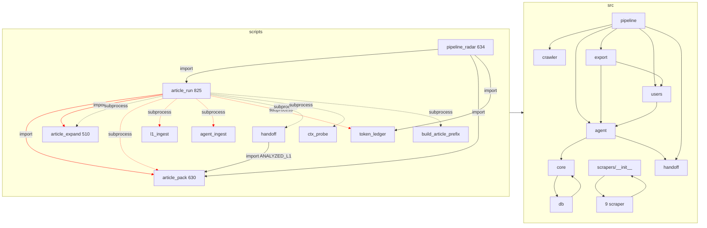

# Kiểm toán B — Kiến trúc và tiêu chuẩn module hoá (news-scape)

- **Ngày:** 2026-09-24 · **Nhánh:** `feature/article-lane-remove-gates` · **Chế độ:** chỉ đọc
- **Phạm vi:** `project/src/` (82 module, 14.113 LOC) và `project/scripts/` (66 tệp gồm `maintenance/`, 10.165 LOC).
- **Phương pháp:** phân tích tĩnh bằng `ast` (script tạm `scratchpad/audit/analyze.py`, `funcs.py`, `reach.py`), grep, đọc mã. Không chạy pipeline, không mở DB.
- **Tái lập:** `C:\venvs\news-scape\Scripts\python.exe scratchpad/audit/analyze.py` in toàn bộ số liệu dưới đây; đồ thị cấp module lưu ở `scratchpad/audit/graph.json`.

---

## 0. Tóm tắt điều hành

| # | Vi phạm | Mức | Bằng chứng chính |
|---|---|---|---|
| V1 | Logic nghiệp vụ Article Lane nằm trong `scripts/`, script import script | Cao | 5 cạnh `scripts→scripts`; `pipeline_radar`/`handoff` import vị từ nghiệp vụ `ANALYZED_L1` từ `scripts/article_pack.py:181` |
| V2 | `article_run --finish` điều phối bằng `subprocess` gọi 6 script anh em | Cao | `scripts/article_run.py:88,412,519,543,561,571,575` |
| V3 | Nguồn đường dẫn DB không duy nhất; có đường vòng qua cổng chặn OneDrive | Cao (lỗi thật) | `scripts/export_csv.py` không truyền `db_path` → `src/export/csv_export.py:14` `DB_PATH="data/monocle.db"` tương đối theo cwd |
| V4 | 55 lệnh `sys.path.insert`, không có `pyproject.toml` | Trung bình | 53 script + `src/morninger.py:14` + `tests/conftest.py:15` |
| V5 | Vòng import cấp gói | Trung bình | `src/core ↔ src/db` (`core/base_scraper.py:12` → `db/dedup.py`); `src/scrapers/__init__` ↔ 9 scraper (import cuối tệp) |
| V6 | Module "god" > 600 LOC và hàm > 100 dòng | Trung bình | 6 module, 19 hàm (dài nhất 243 dòng) |
| V7 | Trùng lặp hạ tầng | Trung bình | 20 định nghĩa `PROJECT_ROOT`, 21 lời gọi `sqlite3.connect`, 12 fallback `"data/monocle.db"`, 2 hàm `resolve_db_path`, 3 định nghĩa múi giờ VN, 4 bản xử lý `'today'` |
| V8 | Tàn dư lane L1/Gold đã ngừng (ADR 0010) vẫn nằm cùng mã sống | Trung bình | 10 script, 1.421 LOC; `L1Runner.route_and_export`, `AgentRunner.export_tasks`, `src/agent/manifest.py` |
| V9 | Không có kiểm tra ranh giới import tự động | Trung bình | `scripts/maintenance/audit_codebase.py` chỉ kiểm git, AST cú pháp, từ cấm, tệp cấm |

Không phát hiện `src → scripts` (tốt: chiều phụ thuộc cơ bản còn đúng).

---

## 1. Số liệu LOC

### 1.1 Theo gói

| Gói | LOC | Ghi chú |
|---|---:|---|
| `scripts/*` (cấp 1) | 8.414 | 53 tệp; 8 tệp Article Lane chiếm 3.476 |
| `src/agent` | 3.146 | lẫn cả Article Lane lẫn lane L1/Gold đã ngừng |
| `scripts/maintenance` | 1.751 | 13 tệp |
| `src/scrapers` | 1.657 | |
| `src/pipeline` | 1.359 | |
| `src/monitor` | 1.349 | |
| `src/db` | 1.250 | `store.py` 799 |
| `src/export` | 1.038 | |
| `src/core` | 997 | |
| `src/crawler` | 702 | |
| `src/telemetry` | 631 | một tệp `dsh_usage.py` |
| `src/handoff` | 488 | |
| `src/users` | 392 | |
| `src/morninger.py` / `src/orchestrator.py` | 359 / 295 | |
| `src/processor` | 258 | |
| `src/notifier` | 137 | |

Tỷ lệ LOC `scripts : src` = **10.165 : 14.113 (0,72)**. Với một dự án mà script đúng ra chỉ là CLI mỏng, tỷ lệ mục tiêu nên dưới 0,25.

### 1.2 Module "god" (> 600 LOC)

| LOC | Module | Loại |
|---:|---|---|
| 825 | `scripts/article_run.py` | CLI + điều phối + sinh mã TS + truy vấn DB + hậu kiểm |
| 799 | `src/db/store.py` | DDL + mọi repository (articles, work_items, l1_tasks, l1_outputs, agent_outputs, seen) — 40 lời gọi `execute` |
| 766 | `scripts/build_entities.py` | dựng danh mục + ghi xlsx |
| 634 | `scripts/pipeline_radar.py` | máy trạng thái vòng đời đợt + báo cáo token + users |
| 631 | `src/telemetry/dsh_usage.py` | đọc phiên DSH + bảng giá |
| 630 | `scripts/article_pack.py` | chọn bài + xếp tầng + chia lô + ghi packet |

### 1.3 Hàm > 100 dòng (19 hàm)

| Dòng | Hàm | Vị trí |
|---:|---|---|
| 243 | `collect_metrics` | `src/monitor/daily_reporter.py:93` |
| 237 | `build` | `scripts/build_entities.py:254` |
| 217 | `main` | `scripts/article_pack.py:409` |
| 203 | `cmd_status` | `scripts/pipeline_radar.py:132` |
| 184 | `main` | `scripts/maintenance/backfill_deferred.py:245` |
| 181 | `build` | `scripts/build_article_prefix.py:146` |
| 172 | `dump` | `scripts/sample_articles.py:217` |
| 169 | `cmd_token` | `scripts/pipeline_radar.py:390` |
| 157 | `main` | `scripts/l1_route.py:45` (lane đã ngừng) |
| 156 | `export_tasks` | `src/agent/runner.py:63` (lane đã ngừng) |
| 144 | `rederive_incremental` | `src/pipeline/derive.py:83` |
| 132 | `_write_xlsx` | `scripts/build_entities.py:543` |
| 128 | `write` | `src/export/user_output.py:370` |
| 127 | `main` | `scripts/run_agent_hierarchy.py:198` (lane đã ngừng) |
| 127 | `cmd_finish` | `scripts/article_run.py:467` |
| 116 | `check_dod` | `src/agent/dod.py:86` |
| 116 | `conductor_program` | `scripts/article_run.py:120` |
| 115 | `generate_markdown` | `src/monitor/daily_reporter.py:337` |
| 108 | `diagnose` | `scripts/diagnose_sources.py:28` |

**Đề xuất:** ngưỡng cứng 100 dòng/hàm và 600 LOC/module cho mã mới; mã cũ vào danh sách "ratchet" (§4.6) chỉ được giảm, không được tăng.

---

## 2. Đồ thị phụ thuộc

### 2.1 Cạnh cấp gói (số lệnh import)

| Từ \ Đến | core | db | agent | crawler | pipeline | handoff | export | users | processor | scrapers | monitor | telemetry | orchestrator | scripts |
|---|---:|---:|---:|---:|---:|---:|---:|---:|---:|---:|---:|---:|---:|---:|
| `scripts/*` | 65 | 29 | 31 | 6 | 8 | 2 | 3 | 4 | 2 | 3 | 4 | 4 | 5 | **5** |
| `scripts/maintenance` | 21 | 7 | 5 | 5 | 1 | 1 | – | – | 1 | 1 | – | – | – | **1** |
| `src.morninger` | 4 | 1 | – | – | 2 | 1 | 1 | – | – | – | – | – | 1 | – |
| `src.orchestrator` | 5 | 3 | – | 1 | – | – | 1 | – | 1 | 1 | 1 | – | – | – |
| `src/agent` | 12 | – | – | – | – | 3 | – | – | – | – | – | – | – | – |
| `src/core` | – | **1** | – | 1 | – | – | – | – | – | – | – | – | – | – |
| `src/db` | 7 | – | – | – | – | – | – | – | – | – | – | – | – | – |
| `src/export` | 8 | – | 1 | – | – | – | – | 1 | – | – | – | – | – | – |
| `src/pipeline` | 5 | 1 | 3 | 4 | – | 3 | 1 | 1 | 1 | – | – | – | – | – |
| `src/scrapers` | 30 | – | – | 3 | – | – | – | – | 9 | (9 vòng) | – | – | – | – |
| `src/users` | – | – | 1 | – | – | – | – | – | – | – | – | – | – | – |
| `src/monitor` | 9 | 2 | – | – | – | – | – | – | – | – | – | – | – | – |

Fan-in cao nhất: `src.core.config` 49, `src.core.stdio` 45, `src.core.models` 44, `src.db.store` 34, `src.agent.entities` 16.

### 2.2 Sơ đồ (mermaid) — hiện trạng, cạnh đỏ là vi phạm



### 2.3 Vòng import

| Vòng | Bằng chứng | Hệ quả | Đề xuất |
|---|---|---|---|
| `src/core ↔ src/db` | `src/core/base_scraper.py:11-12` import `src.crawler.http_client`, `src.db.dedup`; `src/db/store.py:15-16`, `db/dedup.py:12` import `src.core.*` | `core` không còn là tầng đáy; thứ tự import dễ vỡ | Chuyển `BaseScraper` ra `src/bronze/base_scraper.py` (tầng trên `db`), hoặc để `core` khai `Protocol DedupCacheLike` và tiêm `DedupCache` từ ngoài |
| `src.scrapers` ↔ 9 scraper | `src/scrapers/__init__.py:26` import cuối tệp; mỗi scraper `from src.scrapers import register` (`baodautu.py:21` …) | Chạy được nhờ thứ tự khai báo; import một scraper riêng lẻ kéo cả 9 | Tách `src/scrapers/registry.py` (chỉ `REGISTRY`, `register`) và `load_all()` tường minh; scraper import từ `registry` |

### 2.4 Script import script (6 cạnh, gồm import trễ)

| Từ | Đến | Dòng |
|---|---|---|
| `scripts/article_run.py` | `scripts.article_expand.salvage_records` | 267, 293 (import trong hàm) |
| `scripts/article_run.py` | `scripts.article_pack.write_packet` | 319 |
| `scripts/pipeline_radar.py` | `scripts.token_ledger` | 24 |
| `scripts/pipeline_radar.py` | `scripts.article_run` (cả module, bí danh `ar`) | 101 |
| `scripts/pipeline_radar.py` | `scripts.article_pack.ANALYZED_L1, load_candidates` | 142 |
| `scripts/handoff.py` | `scripts.article_pack.ANALYZED_L1, load_candidates` | 24 |
| `scripts/maintenance/refresh_aliases.py` | `scripts.build_entities` | – |
| `scripts/run_validation.py` | `scripts.process_l1_pipeline` | – (lane đã ngừng) |

Thêm: 16 import `from scripts…` trong `tests/test_article_lane*.py` (ví dụ `from scripts.article_run import conductor_program` ×6, `from scripts.token_ledger import SCHEMA`). Test đang khoá API của script, nên mọi lần dời logic phải kèm shim tái xuất.

**Đề xuất:** vị từ và hàm dùng chung chuyển vào `src/article_lane/`; script chỉ import `src.*`.

### 2.5 `sys.path` hack

55 lời gọi `sys.path.insert`: 42 script cấp 1, 12 script `maintenance/` (với ba kiểu viết khác nhau: `parent.parent`, `parents[2]`, `os.path.dirname(os.path.dirname(...))`), `src/morninger.py:14`, `tests/conftest.py:15`. Không có `pyproject.toml`, `src/__init__.py`, `scripts/__init__.py` (namespace package ngầm).

Hệ quả phụ: 30+ dòng `# noqa: E402` chỉ để hợp thức hoá import sau `sys.path.insert`.

**Đề xuất:** thêm `project/pyproject.toml`, cài `pip install -e project` vào `C:\venvs\news-scape`; xoá hack theo từng đợt (§5 bước S12).

### 2.6 Import trễ (trong thân hàm) ở `src/`

11 module, 22 lệnh; đáng kể nhất: `src/pipeline/user_workflow.py` 6 lệnh (dòng 76–107), `src/agent/runner.py` 3, `src/handoff/catalog.py` 3, `src/users/compile.py` 2. Import trễ thường là dấu hiệu né vòng hoặc né chi phí tải `entities.json`.

**Đề xuất:** cho phép import trễ chỉ khi có comment lý do một dòng (`# lazy: nạp danh mục 1.5 MB`); test kiến trúc kiểm cả import trễ.

---

## 3. Trùng lặp logic hạ tầng

### 3.1 Đường dẫn DB — hai hàm cùng tên, 12 fallback chết, một đường vòng qua cổng an toàn

| Hiện vật | Vị trí |
|---|---|
| `resolve_db_path(settings=None)` có cổng chặn OneDrive | `src/core/config.py:127` |
| `resolve_db_path()` bọc lại `load_settings()` | `src/db/preflight.py:14` |
| Fallback `.get("path", "data/monocle.db")` sau `load_settings()` (không bao giờ kích hoạt vì `load_settings` luôn đặt `path`) | `scripts/agent_export.py:61`, `agent_ingest.py:39`, `dbq.py:27`, `db_snapshot.py:24`, `db_status.py:42`, `export_silver.py:27`, `l1_backlog.py:153`, `l1_ingest.py:40`, `l1_route.py:78`, `src/pipeline/user_workflow.py:92`, `src/monitor/daily_reporter.py:65` |
| **Mặc định tương đối theo cwd, bỏ qua cổng chặn** | `src/export/csv_export.py:14` `DB_PATH = "data/monocle.db"`; `src/db/snapshot.py:14-15`; `scripts/maintenance/audit_alias_false_positives.py:17` `PROJECT_ROOT/"data"/"monocle.db"`; `scripts/maintenance/clean_yahoo_lifestyle.py:18` `sqlite3.connect("data/monocle.db")` |

**Lỗi thật (V3):** `scripts/export_csv.py:32-40` gọi `export(...)` không truyền `db_path`, nên `csv_export.query_rows` (`src/export/csv_export.py:46-51`) mở `project/data/monocle.db` — bản sao cũ trong OneDrive — hoặc, nếu không tồn tại, `sqlite3.connect` **tạo một DB rỗng mới trong kho mã** rồi lỗi `no such table`. Cổng `UnsafeDatabasePathError` bị bỏ qua hoàn toàn. `clean_yahoo_lifestyle.py` còn **ghi** vào đường dẫn tương đối.

**Đề xuất:** một hàm duy nhất `src/infra/db.py::connect(mode: Literal["ro","rw"])` gọi `resolve_db_path()`; mọi tham số `db_path` mặc định `None` → `resolve_db_path()`; xoá hằng `DB_PATH` và 12 fallback. Vá `export_csv` là Cấp 1 (1–2 dòng) có thể làm ngay.

### 3.2 `sqlite3.connect` rải rác — 21 lời gọi, 11 tệp

`src/db/store.py:300,305`, `src/db/preflight.py:93`, `src/db/snapshot.py:49,58,60`, `src/export/csv_export.py:49,51`, `src/monitor/daily_reporter.py:80`, `scripts/article_pack.py:114`, `article_run.py:697`, `dbq.py:34,36`, `db_status.py:47`, `estimate_wave.py:64`, `handoff.py:43`, `pipeline_radar.py:52,364`, `token_ledger.py:163`, `maintenance/audit_alias_false_positives.py:58`, `maintenance/clean_yahoo_lifestyle.py:18`. Mỗi nơi tự chọn `timeout` (30.0 / mặc định 5.0), tự quyết `mode=ro`, tự đặt `row_factory` hay không.

**Đề xuất:** `connect()` ở §3.1 kèm `connect_harness(mode)` cho `harness.db`; test kiến trúc cấm `sqlite3.connect` ngoài `src/infra/`.

### 3.3 `PROJECT_ROOT` và thư mục dữ liệu — 20 định nghĩa

6 trong `src` (`agent/entities.py:14`, `agent/prefix.py:29`, `core/config.py:10`, `db/preflight.py:10`, `users/compile.py:14`, `morninger.py:12`) và 14 trong `scripts`. `TASK_DIR` Article Lane định nghĩa hai lần (`article_pack.py:46`, `article_run.py:39`); `HARNESS_DB` ba lần (`estimate_wave.py:30`, `pipeline_radar.py:41`, `token_ledger.py:33`).

**Đề xuất:** `src/infra/paths.py` chứa `PROJECT_ROOT, REPO_ROOT, DATA_DIR, ARTICLE_TASK_DIR, ARTICLE_OUT_DIR, L1_OUT_DIR, GOLD_OUT_DIR, HARNESS_DB`; các nơi khác chỉ import.

### 3.4 Múi giờ và ngày

- Ba định nghĩa múi giờ VN: `src/core/models.py:11` (`timezone(+7)`), `src/scrapers/cafef.py:22` (`ZoneInfo`), `scripts/article_expand.py:63` (dựng tại chỗ; trùng chức năng `src.core.models.now_vn_iso`).
- Xử lý `'today'` → `YYYY-MM-DD` viết lại ở `src/agent/runner.py:151`, `src/export/user_output.py:176,489`, `src/handoff/catalog.py:226`, `src/monitor/daily_reporter.py:34`, `scripts/l1_route.py:125`; `src/export/xlsx_delivery.py:86` có `_parse_date` riêng.
- Lọc ngày bằng `substr(a.published_at,1,10) = ?` lặp ở `article_pack.py`, `handoff.py:79-89`, `pipeline_radar.py:219`.

**Đề xuất:** `src/infra/clock.py` với `VN_TZ`, `now_vn()`, `resolve_day(arg: str) -> date | None` (hỗ trợ `today|yesterday|all|YYYY-MM-DD`); một hằng SQL `DAY_OF(col)` trong `src/article_lane/queries.py`.

### 3.5 Vị từ nghiệp vụ trùng và phân kỳ không có tên

- `ANALYZED_L1` (loại `code_first`) định nghĩa ở `scripts/article_pack.py:181`, dùng lại ở `handoff.py:85`, `pipeline_radar.py:142,173`.
- Giao hàng dùng vị từ khác: `src/export/user_output.py:27` `l1.dod_pass = 1` (nhận cả `code_first`, có cột `l1_source` minh bạch). Đây có thể là chủ đích (ADR 0003 cho phép giao code-first) nhưng không có tên, không có test chốt sự khác biệt.
- `_iter_paths` chép nguyên văn ở `scripts/l1_ingest.py:18` và `scripts/agent_ingest.py:18`; `get_db_connection` ở `article_pack.py:108`, `handoff.py:37`, `pipeline_radar.py:45`.

**Đề xuất:** `src/article_lane/queries.py` khai `ANALYZED_L1` và `DELIVERABLE_L1` có docstring giải thích khác biệt, kèm test khẳng định hai vị từ khác nhau đúng ở `l1_source='code_first'`.

---

## 4. Logic nghiệp vụ nằm trong `scripts/` cần chuyển vào `src/`

| Script | LOC | Logic nghiệp vụ cần chuyển | Đích đề xuất | Phần còn lại ở script |
|---|---:|---|---|---|
| `article_run.py` | 825 | `conductor_program` (sinh chương trình TS, 116 dòng, :120), `warm_packet`, `check_prefix`, `pending_batches`, `missing_indices`, `wave_received_ids`, `wave_article_ids`, `coverage_of`, `verify_wave` (SQL hậu kiểm), `cmd_repair`, `cmd_prepare`, `cmd_finish` (chuỗi 5 bước qua `subprocess`), `MIN_COVERAGE` | `src/article_lane/{conductor,wave,verify,finish}.py` | argparse, in banner, mã thoát (~120 LOC) |
| `article_pack.py` | 630 | `watchlist_universe`, `tier_of`, `_MACRO_URGENT_RE`, `load_candidates`, `ANALYZED_L1`, `read_cleaned_text`, `suggest_batch_size`, `plan_calls`, `write_packet`, `read_windows`, các hằng trần đọc DSH, `main` 217 dòng | `src/article_lane/{select,tiering,batching,packet}.py` | argparse + in dự toán |
| `article_expand.py` | 510 | `unwrap_tool_envelope`, `salvage_records`, `build_l1_output`, `build_gold_output`, `build_mentions`, `process_batch`, `TIME_MAP` — **dựng Data Contract** `l1-entity-output-v1`, `agent-output-v2-lean` | `src/article_lane/expand.py` | argparse |
| `l1_ingest.py` | 100 | Đã mỏng; `_iter_paths` trùng; tự phân giải DB | dùng `src/article_lane/ingest_io.iter_output_paths` + `infra.db` | giữ |
| `agent_ingest.py` | 81 | Như trên | như trên | giữ |
| `pipeline_radar.py` | 634 | `wave_state` (máy trạng thái vòng đời đợt → lệnh kế tiếp), `latest_wave`, quyết định "một lệnh kế tiếp" trong `cmd_status` (203 dòng), `_ledger_rows`, tổng hợp token trong `cmd_token` (169 dòng) | `src/ops/radar.py` (hàm thuần trả `RadarState`), `src/telemetry/ledger.py` | render văn bản + argparse |
| `token_ledger.py` | 475 | `SCHEMA` (DDL bảng `token_ledger` trong `harness.db`), `latest_snapshots`, `worker_calls`, `cache_shortfall`, `cmd_append` (96 dòng), `cmd_verify` | `src/telemetry/ledger.py` | argparse |
| `handoff.py` | 224 | `collect_state` (SQL trạng thái), `render` | `src/ops/handoff_report.py` (tách khỏi `src/handoff/` hiện là catalog work-package, tên dễ nhầm) | argparse |

Quy mô dời ước lượng: khoảng 2.700 LOC từ `scripts/` sang `src/`, hạ `scripts/*` Article Lane từ 3.476 xuống khoảng 700 LOC.

### 4.1 Điều phối qua `subprocess` (V2)

`cmd_finish` (`article_run.py:467-593`) gọi `article_expand.py`, `l1_ingest.py`, `agent_ingest.py`, `token_ledger.py append`, `handoff.py`, `ctx_probe.py` bằng `subprocess.run`, truyền trạng thái qua tham số dòng lệnh và mã thoát. Hệ quả: mỗi bước nạp lại `entities.json` và `settings.yaml`; lỗi chỉ còn mã thoát, mất ngoại lệ có kiểu; không test đơn vị được chuỗi finish mà không chạy tiến trình con. Cùng mẫu này ở lane đã ngừng: `run_agent_hierarchy.py:81-185`, `auto_pilot.py:149-208`.

**Đề xuất:** `src/article_lane/finish.py::finish_wave(wave, steps, min_coverage) -> FinishResult` gọi trực tiếp hàm `expand_wave`, `ingest_files`, `verify_wave`, `ledger.append`, `handoff_report.write`. Giữ nguyên mã thoát 0/1/2 và nội dung banner (khoá bằng test golden trước khi dời). `build_article_prefix --check` có thể giữ `subprocess` nếu cần cô lập.

### 4.2 Tàn dư lane đã ngừng (V8)

Script: `l1_route.py`, `agent_export.py`, `run_agent_hierarchy.py`, `auto_pilot.py`, `process_l1_pipeline.py`, `run_validation.py`, `l1_backlog.py`, `verify_gold_quality.py`, `maintenance/requeue.py`, `maintenance/route_today_l1.py` — **1.421 LOC**. Mã `src` chỉ còn được các script này dùng: `src/agent/manifest.py` (188), `L1Runner.route_and_export`/`drain_code_first` (`src/agent/l1_runner.py:42,144`), `AgentRunner.export_tasks` (`src/agent/runner.py:63`, 156 dòng). Phân tích khả năng tới được từ các điểm vào sống (Article Lane, `morninger`, `run_once`, `health`): 64/82 module `src` tới được; 18 không tới được, trong đó phần thuộc lane cũ là `agent.manifest`.

**Đề xuất:** thực thi phần mã của ADR 0010: xoá (lịch sử git đã giữ) hoặc dời vào `project/legacy/` ngoài `sys.path`, kèm test cấm `src`/`scripts` sống import `legacy`.

---

## 5. Tiêu chuẩn module hoá đề xuất — nội dung dự thảo `.agents/rules/09-module-boundaries.md`

> Dự thảo dưới đây là nội dung đề xuất, chưa được ghi vào kho. Việc thêm rule mới vào `.agents/rules/` thuộc Harness governance, cần người duyệt.

### 5.1 Cấu trúc gói đích

```
project/
  pyproject.toml                 # gói "src" cài editable vào C:\venvs\news-scape
  src/
    infra/                       # T0 — không import gói nội bộ nào khác
      paths.py                   #   PROJECT_ROOT, DATA_DIR, ARTICLE_*_DIR, HARNESS_DB
      settings.py                #   load_settings (từ core/config)
      db.py                      #   resolve_db_path, connect(mode), connect_harness(mode), probe_write
      clock.py                   #   VN_TZ, now_vn, resolve_day
      stdio.py, logging.py, proclock.py, staging.py
    domain/                      # T1 — kiểu dữ liệu và danh mục thuần
      models.py (Article, ScrapeResult), entities.py (EntityRegistry), tickers.py
    store/                       # T2 — truy cập DB; DDL giữ nguyên
      schema.py (DDL hiện tại của store.py, byte-identical)
      articles.py, work_items.py, l1_outputs.py, agent_outputs.py, dedup.py, writer.py
      article_store.py           #   facade ArticleStore giữ API cũ
    bronze/                      # T3 — crawler, http_client, raw_store, base_scraper, scrapers/*
    silver/                      # T3 — processor, silver_builder, derive, change_detect
    article_lane/                # T4 — toàn bộ Article Lane
      queries.py (ANALYZED_L1, DELIVERABLE_L1), select.py, tiering.py, batching.py,
      packet.py, conductor.py, expand.py, intent_resolve.py, prefix.py, distill.py,
      dod.py, ingest.py, wave.py, verify.py, finish.py
    delivery/                    # T4 — users/compile, export/user_output, xlsx_delivery
    telemetry/                   # T4 — dsh_usage, ledger (từ scripts/token_ledger)
    ops/                         # T5 — radar (máy trạng thái), handoff_report, monitor/*
    apps/                        # T6 — morninger, orchestrator
  scripts/                       # T7 — CLI mỏng
  legacy/                        # ngoài sys.path; không ai được import
```

### 5.2 Luật tầng

Một module ở tầng Tn chỉ được import module ở tầng < n, hoặc cùng gói. Cấm import ngang giữa hai gói cùng tầng T3/T4 trừ danh sách cho phép tường minh:

| Tầng | Gói | Được import |
|---|---|---|
| T0 | `infra` | thư viện ngoài |
| T1 | `domain` | `infra` |
| T2 | `store` | `infra`, `domain` |
| T3 | `bronze`, `silver` | T0–T2; `bronze → silver.extractor` được phép (hiện `scrapers → processor`, 9 cạnh) |
| T4 | `article_lane`, `delivery`, `telemetry` | T0–T3; `delivery → article_lane.queries` được phép |
| T5 | `ops` | T0–T4 |
| T6 | `apps` | T0–T5 |
| T7 | `scripts/*` | chỉ `src.*`; **cấm** `from scripts…`, cấm `sys.path` sau khi có `pyproject.toml` |
| – | `legacy/` | không ai import |

Luật bổ sung:
1. `sqlite3.connect` chỉ xuất hiện trong `src/infra/db.py`.
2. Đọc `settings.yaml` chỉ qua `src/infra/settings.py`; cấm hằng `"data/monocle.db"` ở bất kỳ đâu.
3. `Path(__file__).parents[...]` chỉ trong `src/infra/paths.py`.
4. Không `subprocess` gọi `scripts/*.py` từ mã sống; dùng lời gọi hàm.
5. Import trong thân hàm phải kèm comment `# lazy: <lý do>`.
6. Không vòng import cấp gói.

### 5.3 Quy ước CLI mỏng

- Một script = `argparse` + gọi một hàm `src` + in + trả mã thoát. Mục tiêu ≤ 150 LOC, không chứa SQL, không định nghĩa hằng nghiệp vụ.
- Khuôn mẫu:
  ```python
  """<Một câu khẳng định>."""
  from src.infra.stdio import force_utf8_stdio
  from src.article_lane.finish import finish_wave

  def main(argv=None) -> int:
      args = build_parser().parse_args(argv)
      return finish_wave(...).exit_code

  if __name__ == "__main__":
      force_utf8_stdio()
      raise SystemExit(main())
  ```
- Đầu ra văn bản mà agent đọc (radar, `--where`, banner `HOÀN TẤT`) là hợp đồng vận hành: dựng ở `src` dưới dạng dataclass, script chỉ render; khoá bằng test golden.

### 5.4 Quy ước đặt tên

- Gói theo tầng dữ liệu/nghiệp vụ (`bronze`, `silver`, `article_lane`, `delivery`), không theo kỹ thuật chung chung (`agent`, `pipeline`, `handoff` hiện gom nhiều nghĩa).
- Module danh từ số ít, snake_case; hàm động từ (`select_candidates`, `write_packet`, `verify_wave`).
- Vị từ SQL dùng chung: hằng UPPER_SNAKE trong `queries.py` kèm docstring nêu bảng và bí danh bắt buộc (`o`, `a`).
- Script mang tên hành động người vận hành (`article_run`, `write_user_output`); script bảo trì một lần nằm `scripts/maintenance/` và vẫn theo luật T7.

### 5.5 Kiểm tự động

1. `project/tests/test_architecture.py` (pytest, chỉ `ast`, không thư viện mới):
   - dựng đồ thị import từ `src/` và `scripts/` như `scratchpad/audit/analyze.py`;
   - khẳng định: không `scripts→scripts`, không `src→scripts`, không vòng cấp gói, bảng tầng §5.2, `sqlite3.connect`/`"monocle.db"`/`sys.path.insert` chỉ ở nơi cho phép, hàm ≤ 100 dòng, module ≤ 600 LOC;
   - mỗi luật có `BASELINE` (danh sách vi phạm hiện hữu, đóng băng). Test đỏ khi xuất hiện vi phạm **mới** hoặc khi một vi phạm trong baseline đã hết mà baseline chưa được xoá (ratchet hai chiều).
2. Nối vào `scripts/harness_cli.py audit --codebase` thành check thứ 8 "module boundaries" (thuộc Harness Core → xem §6).
3. Tuỳ chọn về sau: `import-linter` với `contracts` dạng `layers` nếu chấp nhận thêm phụ thuộc dev.

---

## 6. Lộ trình strangler

Nguyên tắc: mỗi bước là một story Cấp 2 riêng (WIP=1), dời code kèm **shim tái xuất** ở vị trí cũ để 16 import `from scripts…` trong test và mọi lệnh vận hành giữ nguyên; `pytest tests/` xanh sau từng bước; không đổi DDL, không đổi nội dung đầu ra. Bước chạm Data Contract hoặc Harness Core ghi rõ.

| Bước | Nội dung | Cấp | Bằng chứng hoàn tất | Rủi ro/ghi chú |
|---|---|---|---|---|
| S0 | Vá `scripts/export_csv.py` truyền `db_path=str(resolve_db_path())`; đổi mặc định `csv_export.DB_PATH`/`snapshot` sang `None → resolve_db_path()`; `clean_yahoo_lifestyle.py` và `audit_alias_false_positives.py` dùng `resolve_db_path()` | 1 | test: `query_rows()` không đối số gọi `resolve_db_path` | Đổi hành vi chỉ ở trường hợp đang sai |
| S1 | Thêm `tests/test_architecture.py` với BASELINE đóng băng hiện trạng | 2 | pytest xanh; thêm thử một `from scripts.x` mới → đỏ | Không đổi mã sản phẩm |
| S2 | Tạo `src/infra/{paths,clock,db}.py`; `core/config`, `core/models`, `db/preflight` tái xuất; thay 20 `PROJECT_ROOT`, 3 múi giờ, 12 fallback, 21 `connect` theo từng lô tệp | 2 | baseline giảm; `--where` in y hệt | `connect()` phải giữ `timeout=30` và `mode=ro` đúng như nơi gọi cũ |
| S3 | `src/article_lane/queries.py` (`ANALYZED_L1`, `DELIVERABLE_L1`) + `select.py` (`load_candidates`); `article_pack`, `handoff`, `pipeline_radar` import từ `src` | 2 | cạnh `handoff→article_pack`, `radar→article_pack` biến mất | Giữ thứ tự `ORDER BY` byte-identical (cache tiền tố phụ thuộc) |
| S4 | `src/article_lane/wave.py` (`pending_batches`, `missing_indices`, `wave_received_ids`, `wave_article_ids`, `coverage_of`, `MIN_COVERAGE`) + `verify.py`; radar bỏ `from scripts import article_run` | 2 | cạnh `radar→article_run` biến mất | Radar là hợp đồng Zero-Probe (rule 08): test golden đầu ra `status` trước khi dời |
| S5 | `src/article_lane/{tiering,batching,packet}.py` từ `article_pack`; tách `main` 217 dòng | 2 | `test_article_lane*` xanh qua shim; packet trước/sau so SHA256 trên cùng đầu vào | Packet sai 1 byte = trượt cache |
| S6 | `src/article_lane/expand.py` từ `article_expand` (dời nguyên văn) | 2 nếu dời nguyên văn; **3 nếu đổi bất kỳ trường nào** | đầu ra `*.output.json` trước/sau giống byte trên fixture | **Chạm Data Contract** `l1-entity-output-v1`, `agent-output-v2-lean` (bộ dựng). Bắt buộc golden test; mọi thay đổi trường → ADR |
| S7 | `src/article_lane/conductor.py` từ `conductor_program`, `warm_packet`, `check_prefix` | 2 | `wave_<mã>.conductor.ts` sinh ra giống byte | Chương trình TS là hợp đồng với DSH preset `news-scape-conductor` |
| S8 | `src/article_lane/finish.py::finish_wave` gọi hàm thay `subprocess` cho expand/ingest/verify; ledger và handoff giữ `subprocess` tới S9–S10 | 2 | mã thoát 0/1/2 và banner giống golden; test đơn vị chuỗi finish không cần tiến trình con | Bất biến AGENTS §6.B "cổng thật = cổng kỹ thuật" không được yếu đi |
| S9 | `src/telemetry/ledger.py` từ `token_ledger` (`SCHEMA`, `append`, `report`, `verify`) | **3** | ADR; `SCHEMA` byte-identical; test so hash DDL | **Chạm Harness Core** (`harness.db`, bảng `token_ledger`). Hard Gate: dời mã sở hữu DDL của harness cần duyệt dù không đổi DDL |
| S10 | `src/ops/handoff_report.py` và `src/ops/radar.py` (`wave_state`, quyết định lệnh kế tiếp thành hàm thuần) | 2 | golden `status`, golden tệp bàn giao | Radar/handoff là bề mặt cho agent; đầu ra phải y hệt |
| S11 | Tách `src/db/store.py` thành `store/schema.py` + repository theo bảng; `ArticleStore` thành facade | 2 nếu DDL byte-identical; **3 nếu đổi DDL** | test so DDL trước/sau | **DB Schema** — đổi DDL là Cấp 3 |
| S12 | `pyproject.toml` + `pip install -e project`; xoá 55 `sys.path.insert` và `# noqa: E402` theo từng lô | 2 | chạy `article_run.py --where` và `pytest` không còn hack | Đụng môi trường `C:\venvs\news-scape`; DSH chạy script với cwd `project/` vẫn phải chạy được. Giữ hack ở `morninger` tới khi xác minh Task Scheduler dùng đúng venv |
| S13 | Gỡ vòng `core↔db` (dời `BaseScraper` sang `bronze/`) và vòng `scrapers` (tách `registry.py`) | 2 | test kiến trúc không còn vòng | Giữ shim `src.core.base_scraper` |
| S14 | Thực thi ADR 0010 phần mã: xoá hoặc dời 10 script + `agent/manifest.py`, `L1Runner.route_and_export/drain_code_first`, `AgentRunner.export_tasks` sang `legacy/` | 2 | 18 module không tới được giảm; test cấm import `legacy` | Kiểm `morninger`/scheduler/preset không còn gọi (ADR 0010 khẳng định đã gỡ) |
| S15 | Gom gói theo cấu trúc đích (`bronze/silver/delivery/apps`) bằng shim; siết BASELINE về 0; nối check vào `harness_cli.py audit --codebase` | 2 (gom gói); **3** (sửa `harness_cli`) | BASELINE rỗng | Sửa `harness_cli` = Harness Core |

**Tổng: 16 bước (S0–S15)**. Cấp 1: S0. Cấp 3 bắt buộc: S9, phần nối `harness_cli` của S15; Cấp 3 có điều kiện: S6 (nếu đổi trường Data Contract), S11 (nếu đổi DDL). Còn lại Cấp 2.

Thứ tự khuyến nghị: S0 → S1 (chốt baseline) → S2 → S3 → S4 → S10 (radar/handoff hết import script) → S5 → S6 → S7 → S8 → S9 → S11 → S13 → S14 → S12 → S15. Sau S4 và S10, toàn bộ cạnh `scripts→scripts` của Article Lane biến mất; sau S8, chuỗi `--finish` test đơn vị được.

---

## 7. Đề xuất hành động ngay (không cần chờ lộ trình)

1. **S0** (Cấp 1): vá `scripts/export_csv.py` và các mặc định `"data/monocle.db"` — đây là lỗi thật có thể đọc/ghi nhầm bản sao OneDrive.
2. **S1** (Cấp 2): thêm `test_architecture.py` với baseline để chặn vi phạm mới trong lúc lộ trình diễn ra.
3. Mở story riêng cho S3+S4 vì hai bước này xoá được cả 4 cạnh `scripts→scripts` Article Lane mà không chạm Data Contract.
