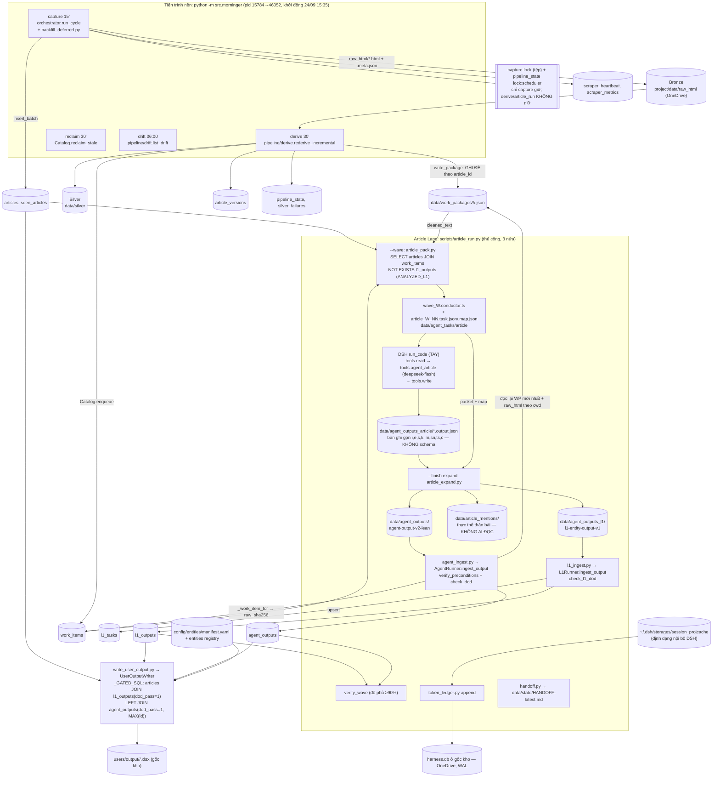

# Kiểm toán E: xử lý và tích hợp luồng dữ liệu đầu-cuối (news-scape)

- **Ngày:** 2026-09-24. **Nhánh:** `feature/article-lane-remove-gates` @ `8ec12f8`.
- **Chế độ:** chỉ đọc. Không sửa tệp nào trong kho. DB vận hành chỉ được mở bằng `file:C:/data/news-scape/monocle.db?mode=ro`. Ba script truy vấn tạm nằm trong scratchpad: `audit/e_db_ro.py`, `audit/e_wave.py`, `audit/e_groups*.py`.
- **Nguyên tắc:** luồng được vẽ lại từ mã, không lấy từ tài liệu. Mỗi phát hiện ghi bằng chứng dạng `tệp:dòng` (đường dẫn tương đối từ `project/`, trừ khi ghi khác) và kết thúc bằng đề xuất có nhãn cấp.
- **Nhãn:** [V] đã kiểm bằng mã hoặc truy vấn chỉ đọc · [I] suy luận.

---

## 0. Tóm tắt điều hành

Xương sống của Article Lane chạy đúng: đợt W1, W2 và W365 đạt độ phủ 97–100% ở cả hai lớp [V `e_wave.py`]. Chỗ yếu nằm ở **ranh giới giữa các tầng**. Mỗi script tự định nghĩa đường dẫn, tự mở DB và tự hiểu hợp đồng dữ liệu theo cách riêng.

Sáu phát hiện nặng nhất:

1. **Hợp đồng đầu ra thật của mô hình (bản ghi gọn `i,e,s,k,im,sn,ts,c`) không có schema và không được kiểm ở ranh giới.** 20,3% chuỗi thực thể thân bài (1.055/5.193) mang mã nhóm sai dạng, ví dụ `IND_GICS2:…` hay `INSTITUTION:FED`, và bị loại âm thầm khỏi danh mục (E-01).
2. **Nguồn gốc bản ghi nội dung bị ghi sai:** 838 dòng `agent_outputs` do DSH/deepseek-flash sinh ra lại mang nhãn `antigravity/flash`. Toàn bộ 664 dòng từ 18/09 mang `confidence=0.9` do mã tự đặt (E-02).
3. **Ba nơi dùng ba vị từ khác nhau cho "đã phân tích L1".** Bộ chọn bài loại `code_first`, còn hậu kiểm độ phủ và giao hàng thì không. Khi đợt kế tiếp lấy 2.915 bài tồn (có sẵn dòng `code_first` đạt), bài mô hình bỏ sót vẫn được tính là "đạt" (E-03, lỗi tiềm ẩn).
4. **Giữa lúc đóng gói và lúc nạp không có khoá, và tệp gói Silver bị ghi đè tại chỗ.** Cổng DoD kiểm trích dẫn với bản Silver mới nhất, không kiểm với packet mô hình đã đọc. Packet cũng không ghi `raw_sha256` (E-04).
5. **`--finish` chặn cả đợt khi chỉ một bản ghi trượt DoD, và chạy lại không bao giờ gỡ được.** Cổng thật vì vậy là 100%, trái với cổng 90% ghi trong AGENTS.md §6B (E-07).
6. **Đường dẫn phụ thuộc cwd:** có 22 định nghĩa `PROJECT_ROOT`, `TASK_DIR` của lane được định nghĩa ở 7 tệp, 20 chuỗi dự phòng `"data/monocle.db"`, và `harness.db` ở chế độ WAL nằm ngay trong OneDrive. Bằng chứng là cả một cây `project/src/data/` sinh ra do chạy sai cwd (E-05, E-06).

Hướng hợp nhất (mục 6), không thêm cổng chặn mới nào:
- một module đường dẫn `src/core/paths.py`;
- một lớp truy cập DB gồm `ArticleStore` cộng một module vị từ dùng chung `src/db/predicates.py`;
- một module hợp đồng `src/contracts/`, kiểm ba ranh giới: đầu ra thô của mô hình, hai lược đồ sau bước bung, và bảng ánh xạ của đợt.

---

## 1. Luồng thật và điểm nối giữa các tầng

### 1.1 Sơ đồ (vẽ từ mã)



### 1.2 Ma trận ghi/đọc theo bảng (DB `C:\data\news-scape\monocle.db`, số dòng lúc kiểm)

| Bảng (dòng) | Ai GHI | Ai ĐỌC | Ghi chú tích hợp |
|---|---|---|---|
| `articles` (14.064) | `ArticleStore.insert_batch` qua `DBWriter` ở orchestrator (`src/db/store.py:565-605`) | `article_pack.load_candidates` (`scripts/article_pack.py:197-220`), `user_output._GATED_SQL` (`src/export/user_output.py:20-35`), `handoff.collect_state`, radar, `L1Runner._register_article_lane_task` (`src/agent/l1_runner.py:202`) | Nguồn sự thật về tiêu đề cho DoD L1 |
| `seen_articles` (12.911) | `insert_batch` (cùng giao dịch, `store.py:587-591`), `dedup` | `src/db/dedup.py` | Số dòng chênh 1.153 (`articles` nhiều hơn `seen`), chưa đối chiếu từng hash [I] |
| `scraper_heartbeat`, `scraper_metrics` | `orchestrator`, `monitor/heartbeat.py` | `monitor/health.py`, `daily_reporter.py`, `db_status.py`, `watch_24h.py` | Còn sống |
| `article_versions` (13.444) | `ArticleStore.insert_version` (`store.py:372-407`) do derive gọi | derive, `drift.list_drift`, `changed_since` | Trạng thái `CONTENT_CHANGED` không được bộ chọn bài đọc (xem E-04) |
| `work_items` (10.122) | `Catalog.enqueue` (`src/handoff/catalog.py:40-82`) do derive gọi; `mark_done`/`mark_failed` do `agent_ingest` gọi; `reclaim_stale` do morninger gọi; `claim` do `agent_export` gọi (lane đã ngừng) | `article_pack` (**chỉ `package_path`**, bỏ qua `status`), `AgentRunner._work_item_for` (`src/agent/runner.py:43-60`), `daily_reporter`, `db_status`, `l1_backlog` | `status` vô nghĩa với Article Lane: 9.283 `pending`, 834 `done`. 112 bài có từ hai `work_items` trở lên |
| `l1_tasks` (8.287) | `L1Runner._register_article_lane_task` (chỉ để có tiêu đề cho DoD, `l1_runner.py:187-214`); `route_and_export`/`drain_code_first` (lane đã ngừng) | `L1Runner.ingest_output` (`l1_runner.py:229`), `daily_reporter`, `db_status`, `l1_backlog`, `heal_orphans`, `requeue` | **Bảng di sản.** Còn 1.369 `needs_agent/pending` và 386 `resolved/pending`, mới nhất 24/09 15:17 (tiến trình morninger mã cũ, trước lần khởi động lại 15:35). Ba cột `code_first_json`, `route`, `packet_path` không có ý nghĩa với Article Lane |
| `l1_outputs` (6.532) | `l1_ingest` (agent); `l1_ingest --code-first` (đã ngừng, còn 3.069 dòng `code_first` đạt) | `article_pack` (vị từ `ANALYZED_L1`), `verify_wave`, `handoff`, radar, `user_output` | Ba vị từ khác nhau cho "đạt" (E-03). Cột `confidence` luôn NULL với Article Lane |
| `agent_outputs` (2.116) | `agent_ingest` → `ArticleStore.insert_agent_output` (`store.py:453-481`, `INSERT OR REPLACE`) | `verify_wave`, `handoff`, `user_output`, radar | Cột `agent_provider`, `model_used`, `confidence` đang ghi giá trị sai (E-02). Có 50 bài mang nhiều dòng (một dòng cho mỗi `raw_sha256`) |
| `pipeline_state` (3) | derive (watermark), khoá scheduler (`store.py:749-798`) | derive, morninger, orchestrator | `lock:scheduler = FPA-AnPT:46052`, tươi |
| `silver_failures` (0) | derive (ADR 0007) | derive | Còn sống |
| `periodic_reports` (3) | `src/pipeline/periodic_reports.py` | `scripts/fetch_periodic_reports.py` | Ngoài Article Lane, lần ghi cuối 07/09 |
| `token_ledger` (**`harness.db`**, không nằm trong `monocle.db`) | `scripts/token_ledger.py append` (INSERT trơn) | `pipeline_radar.py`, `estimate_wave.py` | Nằm trong OneDrive, xem E-06 |

### 1.3 Bảng, cột và trường không còn ai ghi hoặc đọc

| Đối tượng | Trạng thái | Nơi còn ghi | Nơi còn đọc | Đề xuất |
|---|---|---|---|---|
| `materiality`, `event_type`, `impact_area` | **Không có cột DB nào.** Chỉ còn là khoá JSON trong `agent_outputs.output_json`: 1.293 dòng cũ theo lược đồ v1 [V] | Không còn đường ghi nào | `src/agent/packet.py:20` (`_OUTPUT_REQUIRED_V1`, lane đã ngừng), `scripts/verify_gold_quality.py:63,93,107`, `schemas/agent-output-v1.schema.json` (còn `required`), `src/agent/dod.py:110-124` (vẫn chấp nhận v1 làm schema dự phòng) | Gỡ theo T1.5 của plan. Thêm vào đó, `check_dod` phải **từ chối v1 cho bản ghi mới** (E-08). Không sửa JSON cũ. Cấp 2 |
| `articles.sentiment`, `sentiment_score` | Mọi bài từ 18/09 ghi `''` (0/2.741 có giá trị). `sentiment_score` chỉ có ở 1.269 dòng cũ | `Article.to_row` mặc định `""` (`src/core/models.py:80,108`) | `notifier/file_notify.py:92`, `export/csv_export.py:20`, `scripts/sample_articles.py` | Ngừng xuất ra CSV hoặc ghi chú rõ "không dùng". Bỏ cột là đổi schema, Cấp 3 (không đáng làm) |
| `articles.categories` | Ghi bằng regex `classify_rule_based` (`src/orchestrator.py:148`), 13.764 dòng | orchestrator | `user_output._GATED_SQL` có SELECT nhưng không dòng mã nào dùng (`user_output.py:23`, không có `r.get("categories")`) | Bỏ khỏi SELECT. Cấp 1 |
| `l1_tasks` (cả bảng) | Chỉ còn làm "vé vào cổng" cho `L1Runner.ingest_output` | `l1_runner.py:205` | `l1_runner.py:229`, `daily_reporter`, `l1_backlog`, `db_status` | Cho `ingest_output` lấy tiêu đề thẳng từ `articles`, rồi đóng băng `l1_tasks` (không ghi thêm) và gỡ khối báo cáo L1 trong `daily_reporter` (T1.3). Cấp 2 |
| `work_items.status`, `claimed_by`, `claimed_at` | Bộ chọn bài bỏ qua `status`. Chỉ `agent_export` (đã ngừng) đặt `claimed` | `catalog.py:252` (claim), `:286` (mark) | `runner.py:55-57` (sắp xếp theo status), `l1_backlog.py`, job `reclaim` trong morninger (`src/morninger.py:199-218`) | Job `reclaim` đang chạy trên tập rỗng (0 dòng `claimed`). Gỡ job, hoặc giữ nhưng ghi chú là lưới an toàn. Cấp 2 |
| `l1_outputs.confidence`, `agent_outputs.confidence` | L1: NULL. Nội dung: luôn `0.9` do mã đặt | `runner.py:264` | Không có cổng nào đọc (CHANGELOG 2026-08-18 hạ xuống optional) | Ghi NULL thay vì bịa số (E-02). Cấp 2 |
| `data/article_mentions/*.json` | Ghi mỗi đợt | `article_expand.py:403-405` | **Không có** | Xem E-09 |

---

## 2. Điểm tích hợp mong manh

### E-01 (Cao) Hợp đồng đầu ra thật của mô hình không có schema và không được kiểm ở ranh giới

**Bằng chứng.**
- Hợp đồng mà mô hình thật sự phát là bản ghi gọn `{"i","e":[[chuỗi, mã nhóm]],"s","k","im","sn","ts","c"}`. Nó chỉ được định nghĩa trong văn xuôi của persona (`.agents/dsh/presets/news-scape-conductor/agent.cordis.yml:229-253`) và trong mã phân tích của `article_expand.py:357-395`. Thư mục `schemas/` không có tệp nào cho nó.
- `salvage_records` (`scripts/article_expand.py:102-176`) nhận **mọi** dict, không kiểm khoá hay kiểu.
- `IntentResolver.resolve` loại mọi mã nhóm ngoài 11 mã hợp lệ (`src/agent/intent_resolve.py:151-155`), và **không báo gì** khi loại.
- Truy vấn chỉ đọc trên `data/article_mentions/*.json` cho kết quả: **1.055/5.193 (20,3%)** chuỗi thân bài mang mã nhóm sai dạng. Các dạng hay gặp: `IND_GICS2:QUAN_LY_VA_PHAT_TRIEN_BAT_DONG_SAN` (57), `EXCHANGE:HOSE` (40), `MACRO_THEME:DAU_TU_CONG` (38), `INSTITUTION:FED` (35) [V `e_groups*.py`]. Nguyên nhân: prefix nạp danh mục ở dạng `IND_GICS2:… | tên` (`agent.cordis.yml:338-463`), nên mô hình chép luôn định danh vào chỗ của mã nhóm.
- `sn` và `ts` sai giá trị bị lặng lẽ đổi thành `neutral` và `this_week` (`article_expand.py:301-302`), không có dòng đếm nào.

**Hệ quả.** Một phần năm số thực thể mô hình đã nhận ra bị dồn vào `unlisted`, còn sắc thái và độ khẩn sai định dạng bị làm mềm mà không ai biết. Cả hai lỗi đều không lộ ra ở cổng DoD, vì DoD chỉ kiểm hai lược đồ **sau** bước bung.

**Đề xuất.**
- (a) Viết `schemas/article-compact-v1.schema.json` mô tả đúng hợp đồng đang chạy (không đổi hợp đồng). Kiểm từng bản ghi trong `process_batch` ở chế độ **chỉ báo cáo**: đếm vi phạm theo khoá, in ra trong bảng expand và trong handoff. **Cấp 2**, vì hợp đồng không đổi, chỉ được viết ra thành tệp.
- (b) Chuẩn hoá cơ học tiền tố định danh sang mã nhóm (`IND_GICS2:X` → `IND` rồi tra đúng `X`) trong `IntentResolver`. Đây là N0 của brainstorm Jev: 0 token, không thay việc của LLM. **Cấp 2**.
- (c) Sửa gốc ở prompt, theo T3.1: tách bảng danh mục khỏi cột mã nhóm để mô hình không chép định danh. Sau đó sinh lại prefix và dán lại persona (thao tác tay). **Cấp 2 + H**.

### E-02 (Cao) Nguồn gốc và độ tin cậy của bản ghi nội dung bị ghi sai

**Bằng chứng.**
- `agent-output-v2-lean` bỏ hẳn `processing_metadata` (`schemas/agent-output-v2-lean.schema.json:5`). `build_gold_output` cũng không sinh khối này (`article_expand.py:296-304`).
- `AgentRunner.ingest_output` rơi về hằng số `agent_provider="antigravity"`, `model_used="flash"`, `confidence=0.9` (`src/agent/runner.py:257-264`).
- DB có 838 dòng `antigravity/flash`, mới nhất 23/09 16:55. Toàn bộ 664 dòng từ 18/09 có `confidence=0.9` [V `e_db_ro.py`].
- Lớp L1 thì ghi đúng `dsh/deepseek-flash` (`article_expand.py:53-54, 235-240`). Một bài vì vậy mang hai nhãn nguồn khác nhau.
- `user_output._agent_row` đọc `processing_metadata` rồi `ag.get("agent_provider")`, nên cột `agent_provider` và `model_used` trong xlsx để trống cho mọi bài của Article Lane (`src/export/user_output.py:308-322`).
- Hội đồng Jev ghi "Provenance: không đổi" (`docs/proposals/jev-integration-council-2026-09-24.md:162`) và bỏ sót lỗi này.

**Đề xuất.**
- `article_expand` truyền provider và model vào hàm nạp: đọc từ cấu hình preset hoặc từ tham số `--finish`, không hardcode. `runner.ingest_output` ghi NULL khi thiếu, không bịa. Test: nạp bản ghi lean → DB mang `dsh/deepseek-flash`, `confidence IS NULL`. **Cấp 2** (trùng T3.3a).
- Sửa 838 dòng cũ là sửa dữ liệu vận hành: chỉ làm bằng script có `--dry-run`, người duyệt. **Cấp 2 + H**.
- Lưu `prefix_hash` theo đợt vào bảng mới (T3.3b) là **Cấp 3**.

### E-03 (Cao, tiềm ẩn) Ba vị từ khác nhau cho "đã phân tích L1"

**Bằng chứng.**
- Bộ chọn bài: `ANALYZED_L1 = "o.dod_pass = 1 AND COALESCE(o.l1_source,'agent') <> 'code_first'"` (`scripts/article_pack.py:181`, `handoff.py` dùng lại).
- Hậu kiểm độ phủ: `SELECT article_id, max(dod_pass) FROM l1_outputs … GROUP BY article_id` (`scripts/article_run.py:670-675`), **không lọc `l1_source`**.
- Giao hàng: `JOIN l1_outputs l1 … AND l1.dod_pass = 1` (`src/export/user_output.py:27`), **không lọc `l1_source`**, còn in cột `l1_source`.

Kịch bản lỗi:
1. Đợt kế tiếp lấy 2.915 bài tồn ngày 10–17/09. Bộ chọn bài chấp nhận chúng vì các dòng `code_first` của chúng bị loại khỏi `ANALYZED_L1`.
2. Mô hình bỏ sót một bài, nên không có bản ghi `agent` nào ghi đè dòng `code_first`.
3. `verify_wave` đếm dòng `code_first` (`dod_pass=1`) là `l1_ok`. Độ phủ bị thổi phồng và cổng 90% có thể đạt sai.

Hiện có 3.069 dòng `code_first` đạt [V]. Ba đợt đã chạy chưa dính lỗi này (W1, W2, W365 toàn `agent:1` [V `e_wave.py`]), vì bài của chúng không trùng với tập code-first.

**Đề xuất.**
- Tạo một module vị từ duy nhất `src/db/predicates.py` với `ANALYZED_L1`, `ANALYZED_CONTENT` và `WAVE_COVERAGE_SQL`. Pack, verify, handoff, radar và giao hàng đều import từ đây. Đổi sang **danh sách trắng** `l1_source = 'agent'` (N1 của brainstorm), để một `l1_source` mới về sau (`jev`, `relinked`) không tự động được tính là đã phân tích. Test: một bài chỉ có dòng `code_first` → không tính vào độ phủ, vẫn được chọn vào đợt. **Cấp 2**.
- Việc giao hàng có tiếp tục phát bài chỉ mang nhãn `code_first` hay không là quyết định sản phẩm (ADR 0003 so với ADR 0010). Ghi quyết định vào ADR 0010, dạng bổ sung. **Cấp 2 + H**, không đổi schema.

### E-04 (Cao) Packet, gói Silver và `work_items` không được neo vào cùng một phiên bản

**Bằng chứng.**
- Gói công việc được ghi **đè tại chỗ** ở đường dẫn cố định `<domain>/<ngày>/<article_id>.json` (`src/handoff/work_package.py:70-90`). Có 41 bài mang nhiều `work_items` cùng trỏ một tệp [V]. Khoá `work_items` là `(article_id, raw_sha256)`, còn tệp chỉ có một.
- Bộ chọn bài `GROUP BY a.url_title_hash` lấy `w.package_path` tuỳ ý (`article_pack.py:197-211`). Bảng ánh xạ không ghi `raw_sha256` hay băm của gói (`article_pack.py:512-519`).
- Lúc nạp, `_work_item_for` ưu tiên theo `status` (claimed → pending → mới nhất), không theo phiên bản đã đóng gói (`runner.py:52-58`). `check_dod` kiểm trích dẫn với `cleaned_text` của **gói hiện tại** (`src/agent/dod.py:129-143`). `verify_preconditions` băm lại `raw_html` tại thời điểm nạp (`dod.py:73-82`).
- Không có khoá nào giữa `article_run` và job `derive` 30 phút của morninger: `capture_lock` chỉ bọc bước cào (`src/core/proclock.py:456-466`, `morninger.py:244-272`). Trong DB đã có một dòng `precondition: raw_sha256 mismatch` từ 18/09 [V].

**Hệ quả.** Nếu bài được derive lại giữa lúc pack và lúc `--finish`:
- trích dẫn lấy nguyên văn từ packet có thể không còn là chuỗi con của gói mới, nên DoD trượt sai;
- hoặc DoD đạt nhưng `agent_outputs.raw_sha256` trỏ một phiên bản mô hình chưa từng đọc.

Theo AGENTS.md §6B thì "trích dẫn đúng nguyên văn do cấu trúc", nhưng điều đó chỉ đúng khi packet và gói trùng nhau.

**Đề xuất.**
- (a) `article_pack` ghi thêm vào `map.json` các trường `raw_sha256`, `package_sha256`, `package_path` cho mỗi bài. `agent_ingest` nhận `raw_sha256` từ map thay vì tự suy từ `work_items`. DoD grounding kiểm với chính các đoạn trong packet cộng đối chiếu `package_sha256`. Lệch thì ghi lý do `stale_package` (chỉ báo cáo), không trượt âm thầm. **Cấp 2**: `map.json` là tệp nội bộ của lane, không phải Data Contract ngoài, và schema DB không đổi.
- (b) Cho `article_run --finish` và job `derive` dùng chung một khoá tệp đọc/ghi (`proclock` thêm `wave.lock`). Làm theo kiểu khoá hợp tác, không chặn cào. **Cấp 2**.
- (c) Chọn lại bài `CONTENT_CHANGED` (T2.5) chỉ làm sau (a).

### E-05 (Trung bình) Đường dẫn phụ thuộc cwd và định nghĩa rải rác

**Bằng chứng.**
- 22 định nghĩa `PROJECT_ROOT` / `_project_root` / `_root` trong `scripts/` và `src/` [V grep].
- `data/agent_tasks/article` được định nghĩa riêng ở 7 tệp: `article_run.py:40`, `article_pack.py:46`, `article_expand.py:39`, `estimate_wave.py:29`, `handoff.py:33`, `pipeline_radar.py:38`, `token_ledger.py:42`.
- `raw_html_path` lưu dạng tương đối, trộn hai loại dấu phân cách (`data/raw_html\vietstock.vn\20260924\….html`) [V]. `verify_preconditions` gọi `Path(raw_path).exists()` theo **cwd** (`dod.py:74-78`), nên chạy `agent_ingest.py` từ gốc kho thì mọi bản ghi trượt với lý do `raw missing`.
- `--task-dir` của hai lệnh nạp mặc định tương đối (`scripts/l1_ingest.py:32`, `scripts/agent_ingest.py:35`). `write_package(base_dir="data/work_packages")` (`work_package.py:70`, `derive.py:88`) và CSV `data/exports` (`orchestrator.py:177`) cũng vậy.
- Bằng chứng vật lý: `project/src/data/` chứa `monocle.db`, `raw_html`, `silver`, `work_packages`, `exports`. Đây là đầu ra của những lần chạy với cwd = `project/src`.
- `scripts/maintenance/clean_yahoo_lifestyle.py:18` mở thẳng `sqlite3.connect("data/monocle.db")` và vượt qua chốt chặn OneDrive. `src/export/csv_export.py:14` và 20 chỗ khác mang chuỗi dự phòng `"data/monocle.db"`. Hiện các chuỗi này chưa gây lỗi, vì `load_settings` luôn đặt `path` (`src/core/config.py:97`).

**Đề xuất.** Xem mục 6.1 (`src/core/paths.py`). **Cấp 2.** Việc di chuyển 2,1 GB Bronze là **H** (T2.2).

### E-06 (Trung bình) Nhiều lớp truy cập DB song song

**Bằng chứng.**
- Có hai hàm `resolve_db_path`: `src/core/config.py:127` và `src/db/preflight.py:260`. Hàm sau chỉ bọc hàm trước, nhưng đứng ở module khác và tự định nghĩa `PROJECT_ROOT`/`REPO_ROOT` riêng (`preflight.py:256-257`).
- 15 tệp gọi `sqlite3.connect` trực tiếp, ngoài `ArticleStore`: `article_pack.py:114` (mở ghi-đọc dù chỉ đọc), `article_run.py:697`, `handoff.py:43`, `pipeline_radar.py:52`, `estimate_wave.py:64`, `db_status.py:47`, `dbq.py`, `daily_reporter.py`, `csv_export.py`, `snapshot.py`, hai script maintenance.
- `ArticleStore()` mặc định chạy `init_schema()` và `_migrate()` ở **mỗi** lần khởi tạo (`store.py:275-286`). Mọi script chỉ đọc vì vậy vẫn mở kết nối ghi và thực thi DDL.
- `harness.db` (chứa `token_ledger`, story, trace) nằm ở gốc kho trong OneDrive, chế độ WAL. Có tệp `harness.db-wal` và `-shm` cập nhật lúc 15:58 [V]. Đây đúng là rủi ro mà `is_synced_location` chặn cho `monocle.db` (`config.py:105-124`). `harness_cli.py:21` còn dùng đường dẫn tương đối `"harness.db"` theo cwd.

**Đề xuất.** Xem mục 6.2. Riêng việc chuyển `harness.db` ra khỏi OneDrive đụng Harness Core, nên là **Cấp 3** (ADR), và việc di chuyển tệp là **H**.

### E-07 (Trung bình) Xử lý lỗi và tính idempotent của `--finish`

| Bước | Lỗi được xử lý thế nào | Chạy lại có an toàn không |
|---|---|---|
| probe ghi DB | Chặn trước khi nạp, kèm gợi ý sandbox (`article_run.py:510-516`) | Có |
| expand | Mã 1 khi tỷ lệ hỏng > 10%, dừng đợt (`article_run.py:518-527`) | Có: ghi đè tệp đầu ra, chỉ đổi `timestamp` |
| ingest | Mã khác 0 ⇒ dừng đợt (`article_run.py:535-549`). `l1_ingest`/`agent_ingest` trả 1 khi `failed>0` (`l1_ingest.py:96`, `agent_ingest.py:77`) | Một phần. Bản đạt bị bỏ qua (cached), bản trượt được ghi lại |
| verify | Độ phủ < 90% ⇒ mã 1 | Có |
| ledger | Lỗi mềm | **Không**: INSERT trơn, không có khoá duy nhất theo đợt (`token_ledger.py:226-236`). Radar phải tự khử trùng khi đọc |
| handoff | Lỗi mềm, ghi đè | Có |

**Vấn đề 1: cổng thật đang là 100%, không phải 90%.** Chỉ một bản ghi trượt DoD là lệnh nạp trả 1 và `--finish` in "CHƯA HOÀN TẤT". Lệnh chạy lại được gợi ý (`--only ingest,verify,ledger,handoff`) sẽ trượt lại y hệt, vì DoD là tất định. Chính `--repair` cũng không cứu được, vì bài đã có bản ghi (không thiếu) chỉ là trượt. AGENTS.md §6B mô tả cổng là "nạp không lỗi và độ phủ ≥ 90%". Mã hiện đồng nhất "trượt DoD" với "lỗi nạp". Hệ quả: W2 (197/200 L1) nếu chạy lại hôm nay sẽ không bao giờ in `HOÀN TẤT` [I].

**Vấn đề 2: tác dụng phụ lên thư mục lane cũ.** Mỗi lần `--finish`, `l1_ingest` quét và **xoá** `l1_batch_*.task.json` trong `data/agent_tasks/l1` (`l1_ingest.py:80-91`). `agent_ingest` gọi `archive_completed_tasks` trên `data/agent_tasks` (`agent_ingest.py:69-72`). Cả hai đều ngoài phạm vi đợt.

**Đề xuất.**
- Hai lệnh nạp phân biệt mã thoát: **1** = tệp không đọc được hoặc lỗi ghi; **3** = có bản ghi bị DoD loại. `--finish` coi 3 là lỗi mềm và để `verify_wave` quyết định bằng ngưỡng 90%. Test: một bản ghi trượt trong 100 → `HOÀN TẤT`; tệp hỏng → dừng. **Cấp 2.** Nên sửa AGENTS.md §6B cho khớp, để giữ đúng "không thêm cổng".
- `article_run` gọi hai lệnh nạp với `--no-archive`. Gỡ bước dọn `l1_batch_*` (T1.4). **Cấp 2**.
- `token_ledger` thêm khoá duy nhất `(wave, batch_id, agent_id)` và `INSERT OR REPLACE`. Đây là đổi schema `harness.db`, tức Harness Core: **Cấp 3**. Cách rẻ hơn ở Cấp 2: `append` tự xoá dòng cùng `wave` trước khi ghi.

### E-08 (Trung bình) Hợp đồng `agent-output-v2-lean` và `l1-entity-output-v1` lệch khỏi mã

- `agent-output-v2-lean` **không có mục nào trong `schemas/CHANGELOG.md`**, dù chính sách ở đầu tệp đòi bump và giữ ít nhất 2 phiên bản đọc được.
- `check_dod` **đoán** lược đồ bằng heuristic rồi thử lược đồ kia làm dự phòng (`dod.py:110-124`). Bản ghi mới vì vậy vẫn có thể đạt nhờ lược đồ v1 đã ngừng.
- Mô tả của `l1-entity-output-v1` ghi "agent … **tự chấm checklist**" (`schemas/l1-entity-output-v1.schema.json:5`). Thực tế `categories` và `citations` do script sinh: `citations` chỉ là thực thể đầu tiên, còn `categories` có nhánh `if/else` trùng nhau (`article_expand.py:213-224`). Dạng dữ liệu còn đúng, nhưng ngữ nghĩa trong schema đã sai.
- `user_output._agent_row` đọc được cả dạng v1 (dict) lẫn lean (chuỗi) (`user_output.py:308-322`). Đó là hai hợp đồng song song ở tầng giao hàng.

**Đề xuất.** Thêm mục CHANGELOG cho `agent-output-v2-lean` (ngày, trường bỏ) và mục "ngừng ghi" cho `agent-output-v1`. `check_dod` nhận tên lược đồ tường minh từ nơi gọi. Cổng nạp của Article Lane chỉ chấp nhận `v2-lean`. Sửa mô tả `l1-entity-output-v1` cho đúng thực tế. **Cấp 2**, vì chỉ đổi mô tả và đường kiểm, không đổi trường.

### E-09 (Trung bình) Thực thể thân bài rơi vào ngõ cụt

`build_l1_output` chỉ giữ thực thể nằm trong tiêu đề (`article_expand.py:197`). Thực thể thân bài chỉ ghi ra `data/article_mentions/*.json` (`:403-405`), không vào DB, và không module nào đọc [V grep]. Phân tuyến watchlist ở tầng giao hàng chỉ dựa vào `l1_outputs.entities` (`user_output.py:196-199`).

**Đề xuất.** Đây là T3.7 / L3 của hội đồng. Đổi Data Contract hoặc thêm bảng: **Cấp 3, cần ADR**. Trong lúc chờ, ở **Cấp 2** có thể làm: E-01(b) chuẩn hoá mã nhóm, và thêm một báo cáo chỉ đọc số thực thể thân bài khớp watchlist mà tiêu đề không có. Con số này là bằng chứng cho ADR.

### E-10 (Thấp–Trung bình) Lane cũ vẫn chạy được và vẫn để lại trạng thái

- `scripts/run_daily.ps1:94-106` vẫn gọi `l1_route`, `l1_ingest --code-first`, `agent_export`. Hàm `Ingest` nạp **cả thư mục** (`:109-110`), trái với bất biến "chỉ tệp của đúng đợt".
- `l1_route.py`, `agent_export.py`, `run_agent_hierarchy.py`, `maintenance/route_today_l1.py`, `auto_pilot.py:149` đều chạy được và không có chốt chặn nào.
- `l1_tasks` nhận thêm 1.755 dòng `pending` cho tới 24/09 15:17. Morninger mã cũ chạy tới lúc đó. Hiện chỉ còn một tiến trình (launcher 15784 → con 46052, khởi động 15:35, sau lần sửa mã cuối lúc 15:14) [V `Win32_Process`, `pipeline_state`]. Mục "2 cặp tiến trình chạy mã cũ" trong `docs/SESSION-LATEST.md:23` **đã lỗi thời**.

**Đề xuất.** Làm T1.1 và T1.2. Mỗi script lane cũ trước khi chuyển vào `_retired/` được thêm một dòng chặn ở đầu `main()`: in ADR 0010 rồi `return 2`. Cập nhật `SESSION-LATEST.md`. **Cấp 2.**

---

## 3. Tích hợp với DSH (`.agents/dsh/presets/news-scape-conductor/`)

### 3.1 Mã TS sinh ra có khớp preset không

| Điểm khớp | Mã sinh (`scripts/article_run.py:120-235`) | Preset (`agent.cordis.yml`) | Kết luận |
|---|---|---|---|
| Tên công cụ | `tools.agent_article({description, prompt})` | `toolName: agent_article` (`:198`) | Khớp |
| Mô hình | Không nhắc tới | `provider: deepseek-official`, `model: deepseek-flash`, `reasoningEffort: off` (`:523-526`) | Khớp. Nhưng `article_expand.py:53-54` và `runner.py` hardcode tên model riêng (E-02) |
| Không tool cho con | Chương trình không truyền tool | `toolFilter.allow: []`, `maxDepth: 1` (`:540-542`) | Khớp |
| Đọc packet | `tools.read({file_path, offset, limit})`, bóc hai dạng trả về | Hằng `READ_MAX_*` sao từ README `dsh-tool-fs` (`article_pack.py:53-55`) | **Ghép cứng theo phiên bản DSH 0.1.5.** DSH nâng cấp là số trần lệch âm thầm |
| Ghi đầu ra | `tools.write({file_path: OUT + "\\" + id …})`, `OUT` là **đường dẫn tuyệt đối Windows nhúng lúc sinh** (`:144, :219`) | `workspace-write` | Chạy được vì OUT nằm trong kho. Đổi máy hoặc đổi thư mục thì tệp `.ts` cũ hỏng |
| Song song | `CONCURRENCY` = số lô | `maxParallelSubCalls` mặc định 10 (`article_pack.py:86`) | Hằng số chép tay, không đọc từ preset |
| Hình dạng kết quả | Bóc `res.output[].text` (`:214-218`), `article_expand.unwrap_tool_envelope` bóc lần hai | Không có hợp đồng tường minh | Hai tầng phòng thủ cho một hợp đồng ngầm |
| Persona = prefix | `build_article_prefix.py --check` so **tệp** preset với tệp prefix (`src/agent/prefix.py:131-185`) | Nạp **lúc mount** (rule 09) | Kiểm được tệp, không kiểm được runtime. Rule 09 phải so thủ công `StartTime` với `LastWriteTime` |

### 3.2 Điều còn phụ thuộc thao tác tay

1. Dán lại persona vào preset mỗi khi danh mục đổi (`agent.cordis.yml:199-203`). Dán xong phải khởi động lại `dsh web`, rồi mở phiên mới với preset chọn trước.
2. Dán nội dung `wave_<mã>.conductor.ts` vào **một** lệnh `run_code`.
3. Chạy `--finish` và `write_user_output.py` với `danger-full-access`, vì DB nằm ngoài kho (`src/db/preflight.py:309-315`).
4. Sổ cái đọc định dạng log nội bộ `~/.dsh/storages/session_projcache/sessions/*/session.v3.jsonl.zstd` (`src/telemetry/dsh_usage.py:42-67, 513`). Đây là hợp đồng không được công bố. DSH đổi định dạng là sổ cái hỏng âm thầm.
5. Few-shot trong persona dạy sai: bài thép Hòa Phát được gán ngành "Vận tải đường bộ & đường sắt" (`agent.cordis.yml:498-503`; research council L4). Việc sửa chỉ có hiệu lực sau bước (1).

### 3.3 Đề xuất

- `article_run.py --preflight-dsh` (0 token) gom các kiểm sau:
  - băm persona trong tệp so với prefix;
  - `StartTime` của tiến trình cổng 3080 so với `LastWriteTime` của `agent.cordis.yml`;
  - tệp `.ts` của đợt có OUT trỏ đúng `paths.ARTICLE_OUT` không.

  Chỉ báo cáo, trùng T3.13. **Cấp 2**.
- Sinh `.ts` với OUT **tương đối từ workspace root**, nếu `tools.write` chấp nhận. Cần kiểm lại trên DSH trước khi đổi. **Cấp 2**.
- Gom các hằng số DSH (`READ_MAX_*`, `MAX_PARALLEL_BATCHES`, `DEFAULT_MAX_TOKENS`) vào `src/core/dsh_limits.py`, kèm phiên bản DSH đã kiểm. `dsh_usage` kiểm phiên bản định dạng log và báo lỗi rõ ràng khi gặp định dạng lạ. **Cấp 2**.

---

## 4. Đối chiếu các đề xuất đang treo

| Đề xuất / mục | Còn hợp lệ? | Xung đột với dọn dẹp / module hoá? | Ghi chú kiểm toán |
|---|---|---|---|
| **research-council** L1 (fuzzy dedup vứt bài), L2 (bài sửa), L3 (thân bài), L4 (few-shot), L5 (trích dẫn tự bù), L6 (bài trượt nội dung kẹt), L8 (xlsx) | **Hợp lệ** | Không | L2 và L6 cùng gốc với E-04 và E-03: nên làm sau khi có `predicates.py` và `map.json` neo phiên bản |
| research-council §8.3 "`l1_ingest.py:94`, `agent_ingest.py:75` luôn `return 0`" | **Lỗi thời.** Đã sửa ở `46f617f` | — | Nhưng bản sửa sinh ra E-07 (cổng 100%) |
| research-council §3 "morninger chạy mã cũ", "`settings.yaml:3` trỏ DB chết" | **Lỗi thời.** Morninger đã khởi động lại lúc 15:35. `settings.yaml` trỏ `C:/data/news-scape/monocle.db` | — | Cập nhật tài liệu |
| **plan** T0.1, T0.3, T1.4 | **Đã xong** (commit `bb47e44…8ec12f8`, restart 15:35) | — | Đánh dấu done trong plan |
| plan T2.2 (đường dẫn tuyệt đối từ `MONOCLE_DATA_DIR`) | **Hợp lệ, nên mở rộng** | Không. Nên làm cùng `src/core/paths.py` (mục 6.1) thay vì sửa từng tệp | Thêm `raw_html_path` tuyệt đối hoá lúc đọc (E-05) |
| plan T3.3a (provenance) | **Hợp lệ**, mức độ Cao (E-02) | Không | Đẩy lên S1 |
| plan T3.5 (bộ chọn nhận bài có L1 thiếu nội dung) | **Hợp lệ** | **Có**, nếu làm trước khi hợp nhất vị từ: sinh thêm vị từ thứ tư | Làm sau `predicates.py` |
| plan T3.7 (thân bài vào phân tuyến) | Hợp lệ, **Cấp 3** | Không | Cần số liệu từ E-01(b) trước |
| plan T3.12 (`story_clusters`), T2.3 (`capture_daily`), T4.8 (`user_feedback`) | Hợp lệ, Cấp 3 | **Có nguy cơ.** Mỗi bảng mới hiện sẽ tự viết DDL vào `_SCHEMA` khổng lồ và tự thêm `sqlite3.connect` | Làm sau khi có cơ chế migration có đánh số (mục 6.2) |
| **jev-integration-council**: kiến trúc K (`jev_verify.py` sau `--finish`, report-only) | Hợp lệ về ranh giới (không đụng DSH, không phải cổng) | **Có một điểm:** `jev_verify.py` đọc thẳng `*.output.json` và `task.json` trên đĩa, tức thêm một bộ đọc thứ 8 cho thư mục của lane. Bảng `jev_verdicts` (L2) thêm DDL riêng | Buộc dùng `paths.py` và `contracts`. Tiền đề "Provenance không đổi" sai (E-02). Mục D3 (`materiality` trong `_sort_key`) đã lỗi thời sau `18e6633` |
| jev US-028 (dọn registry) | Hợp lệ, Cấp 2 | Không | — |
| jev Spike 0 (Cấp 3 rút gọn) | Hợp lệ về quy trình | Không | Phụ thuộc golden set T3.8 |
| **jev-entity-linking-brainstorm** N0 (chuẩn hoá mã nhóm) | **Hợp lệ, có số đo mới:** 20,3% chuỗi thân bài sai mã nhóm (E-01) | Không | Nên làm ngay, Cấp 2 |
| brainstorm N1 (danh sách trắng `l1_source='agent'`) | **Hợp lệ, cấp thiết hơn đề xuất nêu**, vì còn phủ E-03 (verify + giao hàng) | Không | Gộp vào `predicates.py` |
| brainstorm L1–L11 (Jev linker, vai chủ thể…) | Còn là ý tưởng | Cùng điều kiện với kiến trúc K: ghi bảng hoặc tệp shadow qua `paths`/`contracts` | — |
| agy council (runner thay DSH, `article_tick.py`) | Ngoài phạm vi chính | **Có:** thêm một runner là thêm một nơi sinh và đọc đường dẫn đợt | Chỉ nên làm sau khi `paths.py` và `contracts` có mặt |

---

## 5. Kiểm tra phụ khác

- `project/data/agent_tasks/article/` còn bảng ánh xạ của đợt thử `TESTBLOCK2` [V `e_wave.py`]. Tệp thử đã rò vào thư mục vận hành. Đề xuất: test dùng `tmp_path`, dọn tệp là **H**.
- Có 8 tệp `.db` trong kho: `project/data/monocle*.db`, `archive_conflicts/*.db`, `project/src/data/monocle.db`. Chốt chặn OneDrive giữ đúng cho đường chạy chính, nhưng script maintenance thì vượt qua được (E-05). Việc dọn là **H** (T5.5).
- `.venv` bên trong kho đang được VS Code dùng: pid 74852, `…news-scape\.venv\Scripts\python.exe`. Điều này trái với AGENTS.md §3. Đề xuất đổi interpreter của VS Code sang `C:\venvs\news-scape`. Việc xoá là **H**.
- Mã đợt chứa `_` sẽ đụng mẫu glob `article_{wave}_*` của đợt khác, ví dụ `W1` với `W1_x`. Hiện mã mặc định `%Y%m%dT%H%M` không có `_`. Đề xuất: `article_run` từ chối mã đợt có `_`. **Cấp 1.**

---

## 6. Đề xuất hợp nhất điểm tích hợp

Nguyên tắc: không thêm cổng chặn nào. Mọi kiểm tra mới mặc định chỉ báo cáo. Không script nào được thay việc của LLM.

### 6.1 Một module cấu hình đường dẫn: `src/core/paths.py` (Cấp 2)

```python
# phác thảo, chưa viết mã
PROJECT_ROOT, REPO_ROOT
DATA_DIR        = env MONOCLE_DATA_DIR hoặc settings.data.dir (tuyệt đối)
RAW_HTML_DIR, SILVER_DIR, WORK_PACKAGES_DIR, EXPORTS_DIR
ARTICLE_TASK_DIR, ARTICLE_OUT_DIR, L1_OUT_DIR, CONTENT_OUT_DIR, MENTIONS_DIR, STATE_DIR
USER_OUTPUT_ROOT
def db_path() -> Path          # thay cho config.resolve_db_path và preflight.resolve_db_path
def harness_db_path() -> Path
def resolve_data_path(p: str) -> Path   # chuẩn hoá '\\' và tương đối cho raw_html_path cũ
def wave_files(wave) -> WaveFiles       # packet, map, output, l1, content, mentions, manifest, conductor.ts
```

- Thay 7 định nghĩa `TASK_DIR`, 20 chuỗi `"data/monocle.db"` và các `base_dir` tương đối. `article_run --where` in toàn bộ từ module này.
- Proof: một test chạy cùng lệnh từ ba cwd khác nhau cho ra cùng đường dẫn; `ast.parse`; `pytest tests/`.
- Làn: B + C + D (tệp giao nhau nhiều), nên làm tuần tự, **một story riêng**.

### 6.2 Một lớp truy cập DB (Cấp 2 cho mã, Cấp 3 cho migration)

- `ArticleStore.open_ro()` / `open_rw()` thay cho 15 lời gọi `sqlite3.connect` rời. `init_schema` chỉ chạy ở tiến trình ghi (`morninger`, `--finish`), không chạy ở script chỉ đọc. **Cấp 2.**
- `src/db/predicates.py` giữ `ANALYZED_L1` (danh sách trắng `l1_source='agent'`), `ANALYZED_CONTENT` và câu truy vấn độ phủ đợt. Pack, verify, handoff, radar và giao hàng cùng import từ đây (E-03). **Cấp 2.**
- Tách `_SCHEMA` thành migration có đánh số (`src/db/migrations/0001_*.sql` …), kèm bảng `schema_version`. Chuẩn bị cho các bảng Cấp 3 đang treo (`story_clusters`, `capture_daily`, `user_feedback`, `jev_verdicts`). Đây là **đổi cơ chế schema DB: Cấp 3, cần ADR.** Tác dụng dữ liệu bằng 0 nếu migration 0001 tái tạo đúng DDL hiện tại.
- `harness.db` ra khỏi OneDrive (dùng chung `is_synced_location`): **Cấp 3** (Harness Core) + **H**.

### 6.3 Kiểm hợp đồng dữ liệu tại ranh giới: `src/contracts/` (Cấp 2, trừ khi đổi trường)

| Ranh giới | Hợp đồng | Kiểm ở đâu | Chế độ |
|---|---|---|---|
| Mô hình → đĩa | `article-compact-v1` (mới **viết ra**, không đổi) | `article_expand.process_batch` | Chỉ báo cáo: đếm vi phạm theo khoá, mã nhóm lạ, `sn`/`ts` lạ (E-01) |
| Bung → nạp | `l1-entity-output-v1`, `agent-output-v2-lean` | `l1_ingest`/`agent_ingest` với tên lược đồ **tường minh**, không đoán (E-08) | Như hiện tại (DoD) |
| Pack → nạp | `wave-map-v1` (map có `raw_sha256`, `package_sha256`) | `agent_ingest` lấy phiên bản từ map (E-04) | Lệch thì ghi lý do `stale_package` |
| Nạp → giao hàng | Vị từ trong `predicates.py` | `user_output` | — |

- Một test hợp đồng đầu-cuối: bản ghi gọn mẫu → `process_batch` → `check_l1_dod` + `check_dod` với work package fixture → đạt. Hiện chưa có test nào nối trọn chuỗi này. `tests/test_article_lane.py` kiểm từng mảnh riêng lẻ (`:235-336`).
- **Mọi thay đổi trường** trong ba lược đồ trên (thêm `m`, `prefix_hash`, thực thể thân bài) vẫn là **Cấp 3, cần ADR**.

### 6.4 Thứ tự đề xuất (khớp WIP=1)

| # | Story | Nội dung | Cấp |
|---|---|---|---|
| 1 | "Vị từ và nguồn gốc" | E-03 (`predicates.py` + danh sách trắng), E-02 (provenance, NULL confidence), E-07 (mã thoát 3, `--no-archive`) | 2 |
| 2 | "Hợp đồng ranh giới" | E-01(a)(b), E-08 (CHANGELOG, lược đồ tường minh), test hợp đồng đầu-cuối | 2 |
| 3 | "Neo phiên bản đợt" | E-04(a)(b): map mang `raw_sha256`, khoá `wave.lock` | 2 |
| 4 | "Một module đường dẫn" | 6.1 + E-05 + `open_ro/rw` của 6.2 | 2 |
| 5 | "Dọn lane cũ" | E-10, T1.1/T1.2, đóng băng `l1_tasks` | 2 |
| 6 | ADR "Migration có đánh số + `harness.db` ra khỏi OneDrive" | 6.2 phần Cấp 3 | 3 |
| 7 | ADR "Thực thể thân bài vào phân tuyến" | E-09 / T3.7, dùng số liệu từ story 2 | 3 |

Sửa lại 838 dòng provenance cũ, dọn `TESTBLOCK2`, `project/src/data/`, `.venv` và các `.db` xung đột đều là việc **H**, làm sau story tương ứng.

---

## 7. Phụ lục: bằng chứng chạy chỉ đọc

- `e_db_ro.py`: danh sách bảng, cột, số dòng; phân bố `agent_provider/model_used`; `l1_source`; trạng thái `l1_tasks`, `work_items`; `confidence`; khoá `pipeline_state`.
- `e_wave.py`: độ phủ theo đợt từ các bảng ánh xạ; kiểm `raw_sha256` lệch (0 dòng gần đây); 41 bài dùng chung tệp gói.
- `e_groups.py`, `e_groups2.py`: phân bố mã nhóm trong `data/article_mentions` (1.055/5.193 sai dạng).
- `Get-CimInstance Win32_Process`: một cặp morninger (15784 → 46052), khởi động 15:35.
- `git log`: `feb710c…8ec12f8` commit lúc 15:51–15:52 ngày 24/09. Tệp mã sửa lần cuối lúc 15:12–15:14.
