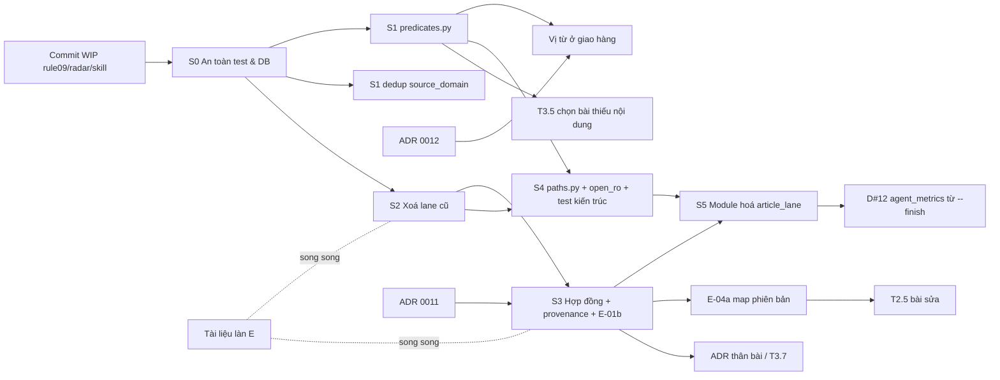

# R2 — Phản biện kiến trúc và trình tự (news-scape)

- **Ngày:** 2026-09-24 · **Nhánh:** `feature/article-lane-remove-gates` @ `45b3f0a` · **Chế độ:** chỉ đọc (không chạy pytest, không mở DB).
- **Đầu vào:** A-dead-code, B-modularization, C-quality-tests, D-harness-docs, E-integration; `plans/20260924-research-council-execution/plan.md`; `AGENTS.md`; `docs/FEATURE_INTAKE.md`; `.agents/rules/04,07,09`; `docs/decisions/0001–0010`.
- **Kiểm thêm trong phiên này (mã, không DB):**
  - `l1_outputs.l1_source TEXT NOT NULL DEFAULT 'agent'` (`project/src/db/store.py:235,331`).
  - `confidence REAL` cho phép NULL (`store.py:176,228`).
  - Radar đọc đồng hồ thật ở `pipeline_radar.py:144,162,303,408,550`, mtime ở `:312`, phiên DSH trong ngày ở `:526`.
  - `.ts` sinh ra nhúng `OUT` tuyệt đối (`article_run.py:161,219`).
  - `.agents/rules/09-dsh-preflight-gate.md` **đã tồn tại** (chưa track). Có thay đổi chưa commit ở `pipeline_radar.py`, `AGENTS.md` và `dsh-preflight-validator/SKILL.md`.
  - Chưa có `project/pyproject.toml`.

---

## 0. Kết luận trong 8 dòng

1. B và E đúng về bệnh, nhưng B kê đơn quá liều cho một dự án một người vận hành. Tám tầng T0–T7, 16 bước strangler, ratchet hai chiều và đổi tên gói hàng loạt tốn nhiều hơn phần nó giữ được. Ba tầng mã cộng một tầng CLI là đủ.
2. B và E đặt tên **khác nhau cho cùng một thứ**: `src/infra/paths.py` so với `src/core/paths.py`, `src/article_lane/queries.py` so với `src/db/predicates.py`. Phải chốt một bộ tên trước khi viết dòng mã nào.
3. Báo cáo gán sai cấp ở năm chỗ đáng kể:
   - Đổi vị từ ở tầng **giao hàng** là Cấp 3, không phải "2+H".
   - Sửa 838 dòng provenance là backfill, nên là Cấp 3.
   - "Mã thoát 3 = lỗi mềm" nới lỏng một cổng vừa được siết ở `46f617f`, cần người quyết.
   - B gán S9 (dời `token_ledger`) Cấp 3 nhưng S11 (tách `store.py`) Cấp 2, dù cả hai đều giữ DDL y hệt.
   - Plan gán T2.1a (fuzzy dedup) Cấp 2, trong khi một nửa của nó là nới luật dedup.
4. Rule module hoá mà B đề xuất đặt số **09**. Số này đang bị `09-dsh-preflight-gate.md` chiếm.
5. Plan 20260924 đã lỗi thời ở T0.1, T0.3, T1.1, một phần T1.4 và một phần T2.2. Có khoảng 12 cặp task trùng với 5 báo cáo. Dưới đây là một trình tự hợp nhất gồm 6 sprint.
6. Năm việc cho tuần tới:
   - (1) Ổn định nền: commit WIP, cách ly DB trong test, vá `export_csv`.
   - (2) Vá fuzzy dedup đang làm mất bài.
   - (3) Hợp nhất vị từ "đã phân tích" trước đợt backlog 2.915 bài.
   - (4) Xoá mã lane cũ.
   - (5) Chuẩn hoá mã nhóm thực thể, kèm số đo.

---

## 1. Phản biện module hoá (B) và hợp nhất (E)

### 1.1 Quy mô thật sau khi dọn

A ước lượng xoá chắc khoảng 3.900 LOC mã và 680 LOC test (lane L1/Gold). Sau bước này `src + scripts` còn khoảng 20K LOC. Trong đó Article Lane thật sự nằm gọn ở 8 script (3.476 LOC) cộng khoảng 1.500 LOC trong `src/agent`.

Phần lớn vi phạm kiến trúc mà B đếm được (scripts→scripts, subprocess, trùng `PROJECT_ROOT`, fallback DB) **tập trung ở 8 tệp Article Lane và các script sắp bị xoá**. Vì vậy kiến trúc cần sửa nhỏ hơn nhiều so với những gì bảng tầng T0–T7 gợi ý.

### 1.2 Tám tầng có đáng không? Không.

| Thành phần của B | Đánh giá | Lý do |
|---|---|---|
| `infra/domain/store/bronze/silver/article_lane/delivery/telemetry/ops/apps` (10 gói mới) | **Quá tay** | Đổi tên gói kéo theo sửa khoảng 200 lệnh import, shim ở mọi đường cũ, và hàng chục tham chiếu trong `okf/`, `project/docs/`, skill (D đếm 8 tài liệu kiến trúc và 9 runbook). Người vận hành duy nhất không nhận thêm giá trị nào. |
| S11 tách `store.py` (799 LOC) thành 6 repository | Bỏ | 799 LOC cho một lớp DDL cộng repository là chấp nhận được. Việc cần làm là docstring (C1.1) và `open_ro()`. |
| S13 gỡ vòng `core↔db`, vòng `scrapers` | Hoãn | Vòng này chạy ổn định từ tháng 7 và không gây lỗi nào. Chỉ làm khi đụng `base_scraper` trong T2.1a (cùng tệp), và chỉ phần tách `registry.py`. |
| S15 gom gói `bronze/silver/apps` | Bỏ | Thuần đổi tên. |
| S12 `pyproject.toml` + `pip install -e` | Hoãn, tuỳ chọn | Giá trị chủ yếu là thẩm mỹ (bỏ `sys.path` và `# noqa`). Rủi ro nằm ở DSH, Task Scheduler và morninger, vì cả ba đều phải dùng đúng venv. Có thể thay bằng một dòng chuẩn duy nhất `from _bootstrap import ROOT` cho mọi script. |
| Ratchet 100 dòng/hàm và 600 LOC/module, BASELINE hai chiều | Bỏ ratchet hai chiều | Luật "baseline hết vi phạm mà chưa xoá thì đỏ" làm một PR không liên quan đỏ test. Đây là ma sát đúng kiểu mà harness đang cố giảm. Giữ số đo trong `audit --codebase`, ở chế độ chỉ báo cáo. |
| Hook vào `harness_cli.py audit --codebase` (S15) | Bỏ | Tự biến một story Cấp 2 thành Cấp 3 (Harness Core). Test pytest là đủ. |

### 1.3 Phương án tối giản đề xuất: 3 tầng mã + 1 tầng CLI

Giữ tên gói hiện có. Chỉ thêm **một** gói mới là `src/article_lane/`.

```
L0  src/core/        config, models, stdio, logging, proclock, staging
                     + paths.py (MỚI: mọi đường dẫn, db_path(), harness_db_path(), wave_files())
                     + clock.py (MỚI, nhỏ: VN_TZ, resolve_day)
L1  src/db/          store.py (+ open_ro/open_rw), preflight, dedup, snapshot
                     + predicates.py (MỚI: ANALYZED_L1, ANALYZED_CONTENT, WAVE_COVERAGE_SQL, DELIVERABLE_L1)
L2  src/{crawler,scrapers,processor,pipeline,agent,handoff,export,users,monitor,telemetry}
                     + src/article_lane/ (MỚI: select, packet, conductor, expand, verify, finish, ledger, radar_state)
L3  src/morninger.py, src/orchestrator.py, project/scripts/*  (CLI mỏng)
```

**Chốt tên (giải xung đột B và E):**
- `paths` ở `src/core/` (theo E). Lý do: `core.config` đã có fan-in 49, và `resolve_db_path` đang nằm ở đó.
- Vị từ ở `src/db/predicates.py` (theo E). Lý do: `user_output` (tầng giao hàng) cũng dùng nó, nên nó không thuộc riêng lane.
- Kiểm hợp đồng ở `src/article_lane/contracts.py`, không mở gói `src/contracts/`. Hiện chỉ có một bên tiêu thụ là lane.

**Bốn luật tự động (một tệp `tests/test_architecture.py`, chỉ dùng `ast`, chỉ báo khi có vi phạm MỚI):**
1. Không `from scripts…` trong `project/scripts/**` và `project/src/**`. Ngoại lệ tạm thời duy nhất là `tests/`, cho tới khi sprint module hoá xong.
2. Không `src → scripts`.
3. `sqlite3.connect`, chuỗi `"monocle.db"` và `harness.db` chỉ xuất hiện trong `src/core/paths.py`, `src/db/store.py`, `src/db/preflight.py`, `src/db/snapshot.py`.
4. `Path(__file__).parents[...]` để tìm gốc dự án chỉ được viết trong `src/core/paths.py`. Script dùng `paths.PROJECT_ROOT`.

Allowlist là danh sách vi phạm hiện hữu. Test đỏ khi xuất hiện vi phạm mới, **không** đỏ khi vi phạm cũ biến mất. Bỏ luật tầng chéo gói T3/T4, bỏ trần dòng. Luật về subprocess để sang sprint module hoá, vì chỉ có một chỗ (`cmd_finish`).

**Tiêu chí "script CLI mỏng":** không chứa SQL, không định nghĩa hằng nghiệp vụ, không import script khác. Mục tiêu ≤ 150 LOC chỉ là hướng dẫn, không phải test.

### 1.4 Shim tái xuất có tạo nợ mới không? Có, nếu để vô thời hạn.

- Lý do chính B đưa ra để giữ shim là 16 import `from scripts…` trong `tests/test_article_lane*.py`. Hai tệp test này nằm trong repo, và sửa import **cùng commit** với lần dời mã rẻ hơn giữ shim. **Không dựng shim cho test.**
- Shim cho người gọi ngoài repo không tồn tại. DSH gọi script qua dòng lệnh chứ không import, nên đường dẫn `scripts/article_run.py` vẫn giữ nguyên.
- Shim có lý do duy nhất là `src.core.config.resolve_db_path` (49 nơi import `core.config`). Để hàm cũ gọi `paths.db_path()`. Thêm tên hàm cũ vào allowlist của test kiến trúc kèm ghi chú "xoá ở sprint S5", để shim có hạn chót.
- Nếu vẫn dùng shim thì phải có story xoá shim ngay trong sprint kế tiếp. Nếu không, shim trở thành đúng loại "đường quay lui nằm sẵn trong mã" mà ADR 0010 §4 cấm.

### 1.5 Golden test "giống từng byte": khả thi ở đâu

| Đối tượng | Giống byte được không | Điều kiện |
|---|---|---|
| Packet `article_*_NN.task.json` (S5) | **Được** | Đầu vào là fixture DB và work package, sắp xếp tất định. Đây là golden đáng làm nhất, vì cache tiền tố phụ thuộc vào thứ tự byte. |
| `wave_<mã>.conductor.ts` (S7) | Được, sau khi chuẩn hoá | `OUT` là đường dẫn tuyệt đối nhúng lúc sinh (`article_run.py:161`). Hoặc truyền `out_dir` cố định trong test, hoặc thay bằng placeholder trước khi so. |
| Đầu ra `article_expand` (S6) | Được, sau khi chuẩn hoá | Bỏ trường `timestamp` và `processing time` (E-07 đã nói chạy lại chỉ đổi `timestamp`). |
| Banner `--finish` và mã thoát (S8) | Được | Hàm thuần nhận `FinishResult`. |
| **Radar `status` (S4/S10)** | **Không, nếu giữ nguyên dạng hiện tại** | Radar đọc `datetime.now()` ở 5 chỗ, mtime tệp, phiên DSH "hôm nay" (`:526,550`), số dòng DB sống. Tên đợt đề xuất `W%m%d%H%M` (`:303`) đổi theo phút. Test y hệt từng byte sẽ đỏ theo đồng hồ. |

**Đề xuất cho radar:**
1. Tách `decide(state: RadarState) -> list[Recommendation]` thành hàm thuần. Test hàm này bằng **bảng quyết định**: khoảng 10 trạng thái vòng đời đợt, mỗi trạng thái đúng một lệnh kế tiếp. Đây mới là hợp đồng Zero-Probe thật (rule 08), còn văn bản in ra thì không.
2. Phần render: golden với `now` tiêm vào, DB `tmp_path` và thư mục phiên DSH giả. So sau khi chuẩn hoá số và thời gian bằng regex. Đó là golden cấu trúc, không phải golden từng byte.
3. **Điều kiện tiên quyết:** `pipeline_radar.py` đang có thay đổi chưa commit. Chụp golden trước khi commit là chụp nhầm đích.

### 1.6 Hợp nhất của E: đồng ý phần lớn, trừ ba điểm

- **Đồng ý:** `paths.py`, `predicates.py`, `open_ro()` (không `init_schema` ở tiến trình chỉ đọc), schema `article-compact-v1` ở chế độ chỉ báo cáo, `map.json` mang `raw_sha256`.
- **Không đồng ý 1: migration có đánh số (6.2) lúc này.** Chưa có bảng Cấp 3 nào được duyệt. Dựng cơ chế migration trước nhu cầu là một ADR Cấp 3 không có người dùng. Chỉ làm khi ADR đầu tiên thêm bảng (T2.1b, T2.3, T3.12…) được duyệt, và gộp vào chính ADR đó.
- **Không đồng ý 2: `wave.lock` giữa `derive` và `--finish` (E-04b).** Đây là khoá chặn tiến trình. Nó chạm cờ Scheduler/pipeline flow và buộc khởi động lại morninger (H). Dữ liệu chỉ có 1 lần lệch `raw_sha256` từ 18/09. Làm E-04a trước (map ghi phiên bản, lệch thì báo `stale_package`), đo tần suất, rồi mới quyết khoá.
- **Không đồng ý 3: E-10 thêm "`return 2` ở đầu `main()`" cho script lane cũ.** Nếu xoá (`git rm`) thì bước này thừa. `_retired/` trong repo thì trái ADR 0010 §4 ("không có đường quay lui tạm nằm sẵn trong mã"). **Chọn `git rm`.** Lịch sử git đủ để quay lui.

---

## 2. Phân cấp rủi ro lại theo `docs/FEATURE_INTAKE.md`

Chú thích: **Gốc** là cấp mà báo cáo hoặc plan gán, **R2** là cấp đề xuất lại. Cờ viết tắt: DB, Dedup, DC (Data contract), Cfg, Sched, Tested, Weak. **HG** = hard gate. **H** = cần người thao tác.

### 2.1 Các chỗ gán sai hoặc thiếu (quan trọng nhất)

| Hạng mục | Gốc | R2 | Lý do |
|---|---|---|---|
| E-03: đổi vị từ sang whitelist `l1_source='agent'` ở **pack, radar, handoff** | 2 | **2** (thực chất không đổi hành vi) | Cột `NOT NULL DEFAULT 'agent'` (`store.py:235`), và chỉ có hai giá trị `agent`/`code_first`. Whitelist tương đương blacklist, nên số liệu lịch sử không đổi. Proof: test một dòng `code_first` và một dòng `agent`. |
| E-03: áp vị từ vào **`verify_wave`** | 2 | **2** | Thực thi ADR 0010 §2.4 mục 4, vốn đã accepted. Cổng chặt hơn chứ không lỏng hơn. W1, W2, W365 toàn `agent`, nên độ phủ lịch sử không đổi. |
| E-03: áp vị từ vào **giao hàng** (`user_output._GATED_SQL`) | "2+H" | **3** | Người dùng nhận xlsx **khác đi**: khoảng 3.069 bài chỉ có `code_first` biến khỏi tệp giao. Đây là đổi hợp đồng dữ liệu phía người tiêu thụ và đảo ADR 0003. Cần ADR. |
| E-02: sửa 838 dòng `agent_outputs` cũ | "2+H" | **3** | FEATURE_INTAKE ghi rõ "irreversible data change … backfill" là hard gate. Script `--dry-run` không hạ cấp được. |
| E-02: ghi provenance đúng cho dòng mới, `confidence` NULL | 2 | **2** | Cột cho phép NULL (`store.py:176,228`). Cột `agent_provider`/`model_used` trong xlsx đổi từ rỗng sang có giá trị (thay đổi cộng thêm, tầng master). |
| E-07: mã thoát 3 = DoD loại là "lỗi mềm", cổng chỉ còn độ phủ ≥ 90% | 2 | **3 (rút gọn: ADR ngắn, người quyết)** | Đảo quyết định fail-loud vừa commit ở `46f617f` (US-025) và chạm bất biến AGENTS §6B, tức Harness Core. Về hình thức đây là nới một bảo đảm kiểm định (HG). Nội dung đề xuất hợp lý (chữ §6B nói 90%), nhưng người phải chốt nghĩa của "nạp không lỗi". |
| E-04a: DoD kiểm trích dẫn theo **packet** thay vì gói Silver hiện tại | 2 | **3 nếu đổi nguồn đối chiếu; 2 nếu chỉ ghi `stale_package`** | Đổi thứ mà DoD kiểm là đổi một bảo đảm kiểm định. Phần `map.json` mang `raw_sha256` và `package_sha256` thì đúng là Cấp 2. |
| E-04b: `wave.lock` | 2 | **2 + H, hoãn** | Chạm cờ Sched và Tested, phải khởi động lại morninger. Xem §1.6. |
| E-06 / D §5.6: dời `harness.db` khỏi OneDrive | 3 + H | **3 + H** (đồng ý) | Đổi vị trí DB harness, lệnh §5 AGENTS.md và mọi trace. |
| D §5.6: neo `DEFAULT_DB_PATH` của `harness_cli` thành đường dẫn tuyệt đối | "MỚI" (không gán) | **2** | Sửa lỗi cwd, không đổi hành vi khi chạy đúng cwd. Nên gộp vào ADR Harness để khỏi mở hai lần Harness Core. |
| B S9: dời `token_ledger` sang `src/` với DDL y hệt | 3 | **2** | Không đổi schema, có test băm DDL. B tự mâu thuẫn khi gán S11 (tách `store.py`, DDL y hệt) Cấp 2. |
| E-07 / D: khoá duy nhất cho `token_ledger` | 3 | **3** (đồng ý) | Đổi schema harness. Phương án Cấp 2 thay thế: `report` chỉ lấy dòng mới nhất mỗi đợt. `latest_snapshots` đã làm việc này (`test_article_lane.py:750`), nên **không cần** đổi schema. |
| A và D: sửa `registry.yaml` | 3 | **2 cho sửa mô tả, 3 cho đổi trạng thái hoặc DAG** | Rule 07 quản lý registry. Sửa `data/monocle.db` → đường dẫn thật, hay `--today` → `--date`, là làm tài liệu khớp thực tế. Chuyển agent `active`/`retired`, hoặc thêm/bỏ stage, mới là Harness Core. **Hệ quả:** T-00 (trace #80) đã gỡ stage `materiality_triage` mà không có ADR, nên cần ADR hồi tố. |
| B: thêm rule `09-module-boundaries.md` | "Harness governance" | **2, và không tạo rule mới** | Số 09 đã bị chiếm. Luật kiến trúc nên là test cộng 5 dòng trong rule 06 (chuẩn mã), không phải một rule `always_on` mới làm tăng ngữ cảnh mỗi phiên (rule 08 giới hạn 3 tệp đầu). |
| Plan T2.1a: vá fuzzy dedup | 2 | **Tách làm hai:** truyền `source_domain` đúng dạng là **2**; miễn fuzzy cho tiêu đề CBTT là **3 (HG: nới bảo đảm dedup)** | Sửa `self.name` thành `cafef.vn` để khôi phục đúng thiết kế ("khác nguồn"), không nới gì. Miễn cả một lớp tiêu đề khỏi fuzzy là nới luật. Có thể gộp vào ADR của T2.1b. |
| Plan T1.4 | 2 | **Đã xong một nửa** (`46f617f`). Phần "gỡ dọn `l1_batch_*`" gộp vào story xoá lane cũ | — |
| Rule 09 đang viết (chưa track): "ĐỎ chặn đợt" | chưa gán | **Cần intake** | Một cổng chặn mới trên đường vận hành, chạm AGENTS §9 (đã sửa, chưa commit). Nó không phải cổng token, nhưng phải được ghi ADR hoặc story rõ ràng, để không mâu thuẫn với nguyên tắc "không thêm cổng chặn". |

### 2.2 Bảng gán cấp toàn bộ hạng mục (gộp theo nhóm)

| Nhóm | Hạng mục (nguồn) | R2 |
|---|---|---|
| **An toàn** | B S0 / A 1a: vá `export_csv` `db_path`, bỏ mặc định `"data/monocle.db"` ở `csv_export`, `snapshot` | 1 |
| | C2.4: test `backfill_deferred --dry-run` chạm DB thật; fixture autouse `MONOCLE_DB_PATH=tmp_path` | 2 |
| | C: `backfill_deferred --dry-run` mở chỉ đọc (`init_schema=False`) | 2 |
| | C2.1: `test_harness_cli.py:55` cứng `schema_version=2`; test khoá flaky | 1 |
| | C3.2: sửa comment sai `token_pricing.yaml:32-34` | 1 |
| | C1.5: `dod.py:55` log và ném lỗi khi YAML ngưỡng sai kiểu | 2 (chặt hơn, Tested) |
| | D: `dsh-preflight-validator` bỏ D2 `requeue`, sửa 12→14 hạng mục | 1 (**đợi** WIP chưa commit của tệp này) |
| | D: sửa "ADR 0010" và "Intake #25" trong đề xuất agy | 1 |
| **Vị từ, đường dẫn** | E-03 ở pack, verify, radar, handoff (`src/db/predicates.py`) | 2 |
| | E-03 ở giao hàng | **3** |
| | E 6.1 / B S2 / plan T2.2: `src/core/paths.py`, gom 20 `PROJECT_ROOT`, 7 `TASK_DIR`, 12–20 fallback | 2 |
| | E 6.2: `ArticleStore.open_ro()` | 2 |
| | E-05: `raw_html_path` tuyệt đối hoá lúc đọc | 2 |
| | E: từ chối mã đợt chứa `_` | 1 |
| **Mã chết** | A 1a (9 tệp), 1b (script, test, skill), 2 (tách `export_tasks`, `route_and_export`, `batch_handoff`, `pruner`, `archive`) / plan T1.1, T1.2 / B S14 / E-10 | 2 (một story) |
| | A: gỡ job `reclaim` khỏi morninger | 2 + H (restart) |
| | A 1c: `monitor_daily`, `domain_check`, `validate_e2e`, `sample_articles`, `run_pipeline.ps1` | H (người quyết từng mục) |
| | A §4: `.venv` ×2, DB cũ 832 MB, `project/src/data`, root `data/`, pycache, log xung đột / plan T5.5 | 1 + H |
| | A: skill `gold-financial-analyst`, `materiality-triage`, `news-scape-agent-operations` → `_retired/` | 2 |
| **Hợp đồng** | E-01a: `article-compact-v1.schema.json`, kiểm chỉ báo cáo / plan T3.4 | 2 |
| | E-01b: chuẩn hoá tiền tố mã nhóm trong `IntentResolver` (N0) | 2 (cờ Classification + Tested). Không phải giả lập agent: ánh xạ cơ học trên chuỗi mô hình đã phát. |
| | E-01c / plan T3.1: sửa prompt và few-shot, dán persona | 2 + H |
| | E-02: provenance dòng mới / plan T3.3a | 2 |
| | E-02: backfill 838 dòng | **3** |
| | E-08: CHANGELOG `v2-lean`, `check_dod` nhận tên lược đồ tường minh, từ chối v1 cho bản ghi mới / plan T1.5, T3.6 | 2 (từ chối v1 là chặt hơn; grep xác nhận không nguồn nào còn sinh v1) |
| | E-09 / plan T3.7: thực thể thân bài vào phân tuyến | 3 |
| | E-04a: `map.json` mang phiên bản, báo `stale_package` | 2 |
| **Module hoá** | `src/article_lane/` dời logic từ `article_pack`, `article_expand`, `article_run`, `token_ledger`, `handoff`; radar `decide()` thuần; `finish_wave()` gọi hàm thay subprocess | 2 (golden trước khi dời) |
| | `tests/test_architecture.py` (4 luật) | 2 |
| | B S11, S12, S13, S15 | Bỏ hoặc hoãn (§1.2) |
| **Chất lượng** | C1.1 docstring `store.py`, `harness_cli.py`; C1.4 31 comment lịch sử; C1.6 `print` trong `src` | 2 (theo lô, không đổi hành vi) |
| | C4.2 ruff, C4.3 `pytest.ini` với marker `slow` / plan T5.4 | 2 (`filterwarnings=error` hoãn) |
| | C2.7 gom fixture `env` ×16; C2.3 tăng tốc `test_baodautu` | 2 |
| | C3.3 hai danh sách watchlist; C3.4 khoá domain chết | 1–2 |
| **Harness, tài liệu** | D #1, #6, #8, #9, #10, #14 / plan T5.2 (mở rộng thành T5.2a `.agents`, T5.2b `project/docs` + `okf`) | 2 (thuần tài liệu) |
| | D #7: dọn `harness.db` (retire story, đóng backlog, `decision add`) | 2 (thao tác dữ liệu harness qua CLI, không đổi schema) |
| | D #4: ADR hồi tố ngừng `materiality` | 3 (hồ sơ) |
| | D #11 / plan T5.1: `harness_cli` bỏ `or 1`, schema v3, `004-token-ledger.sql` | 3 |
| | D #12: `--finish` ghi một dòng `agent_metrics` mỗi đợt | 2 (sau sprint module hoá, vì chạm `cmd_finish`) |
| | Plan T5.3: nới Closure cho Cấp 1 | 3 |

### 2.3 ADR cần lập (số kế tiếp: **0011**, vì `docs/decisions/` dừng ở 0010)

Số ADR chỉ được cấp khi lập (D §4.3), nên dãy dưới đây là thứ tự đề xuất, không phải số giữ chỗ.

| ADR | Tên | Phạm vi (một câu) | Hạng mục |
|---|---|---|---|
| 0011 | Ngừng `materiality`/`event_type`/`impact_area` (hồi tố) | Ghi thành quyết định việc T-00 đã gỡ ba trường khỏi đầu ra, registry và pipeline, và chốt v1 chỉ còn đọc được, không nhận bản ghi mới. | T-00, trace #80, E-08, T1.5 |
| 0012 | Ngữ nghĩa "đã phân tích" và cổng hoàn tất đợt | Chốt vị từ duy nhất `l1_source='agent'` cho chọn bài, độ phủ, radar; quyết giao hàng có còn phát bài chỉ có `code_first` hay không (đảo ADR 0003); chốt DoD loại là lỗi mềm hay cứng trong `--finish`. | E-03, E-07 |
| 0013 | Bảo trì Harness Core | Định nghĩa ranh giới "Harness Core" (tệp nào, lệnh nào); sửa `harness_cli` (T5.1); neo đường dẫn; `004-token-ledger.sql`; dời `harness.db` khỏi OneDrive. | T5.1, D #11, E-06, D §5.6 |
| 0014 | Provenance bản ghi nội dung | Chốt nguồn provider/model lấy từ cấu hình preset, `confidence` là NULL khi mô hình không phát, và có sửa 838 dòng cũ hay không. | E-02 phần backfill |
| 0015 | Chính sách fuzzy dedup | Chốt phạm vi fuzzy (khác nguồn, cửa sổ, miễn trừ CBTT) và bài bị đánh dấu trùng vẫn lưu Bronze với `duplicate_of`. | T2.1a (phần nới luật), T2.1b |
| sau | Thực thể thân bài vào phân tuyến | Đổi `l1-entity-output` hoặc cho giao hàng đọc `article_mentions`, dựa trên số đo E-01b và golden set. | E-09, T3.7 |
| sau | Rule 09 DSH preflight gate | Nếu rule giữ "ĐỎ chặn đợt" thì cần một ADR ngắn giải thích vì sao đây là cổng hạ tầng, không phải cổng chất lượng hay token. | rule 09 đang viết |

Các ADR T2.3, T2.4, T3.3b, T3.12, T4.8 và migration có đánh số: giữ trong S4 của plan, không mở tuần này.

---

## 3. Xung đột và trùng lặp với plan 20260924

### 3.1 Task lỗi thời

| Task plan | Trạng thái | Bằng chứng |
|---|---|---|
| T0.1 commit | Xong | `bb47e44…45b3f0a`. Còn một WIP mới chưa commit (rule 09, skill, radar, AGENTS.md). |
| T0.3 restart morninger | Xong | E-10: khởi động 15:35 ngày 24/09 |
| T1.1 sửa `run_daily.ps1` | Lỗi thời | A: không Task Scheduler nào gọi tệp này, nên xoá cả tệp |
| T1.4 thoát khác 0 | Xong (`46f617f`) | Phần "gỡ dọn `l1_batch_*`" chuyển vào story xoá lane cũ. Hệ quả E-07 chuyển vào ADR 0012. |
| T2.2 "sửa `settings.yaml:3` trỏ `C:\data`" và preflight OneDrive | Xong | `39c9898`, E §4 |
| research-council §3, §8.3 | Lỗi thời | E §4 |

### 3.2 Gộp

| Gộp thành | Từ |
|---|---|
| **Xoá lane cũ** | T1.1 + T1.2 + phần còn lại của T1.4 + A 1a/1b/2/3 + B S14 + E-10 + C2.6 |
| **Vị từ** | E-03 + brainstorm N1 + B S3 (phần `queries`) |
| **Đường dẫn** | T2.2 (phần mã) + B S2 + E 6.1 + E-05 + C1.7 |
| **Hợp đồng ranh giới** | T3.3a + T3.4 + T3.6 + T1.5 (phần schema) + E-01a/b + E-02 + E-08 |
| **Preflight DSH** | T3.13 + E 3.3 + rule 09 đang viết + D (skill `dsh-preflight-validator`) |
| **Test nhanh** | T5.4 + C4.3 + C2.3 |
| **Dọn môi trường** | T5.5 + A §0, §4 |
| **Tài liệu** | T5.2 + D 12 mục bỏ sót + A §5 + T3.14 (skill và registry mô tả) |
| **Harness Core** | T5.1 + D #11 + E-06 (ADR 0013) |

### 3.3 Thứ tự bắt buộc giữa các task

1. **Commit WIP đang dở** (rule 09, `pipeline_radar.py`, skill, AGENTS.md) phải xong trước mọi việc chạm radar, skill hay AGENTS.md.
2. **Xoá lane cũ trước Đường dẫn.** 12 fallback `"data/monocle.db"` nằm một phần trong script sắp xoá (`agent_export`, `l1_route`, `l1_backlog`). Xoá trước thì bớt việc sửa.
3. **Vị từ trước T3.5 và T2.5.** Nếu không, T3.5 sinh ra vị từ thứ tư (E §4).
4. **Xoá lane cũ trước T1.5 và E-08.** Xoá `packet.py` sẽ gỡ luôn `_OUTPUT_REQUIRED_V1`.
5. **Hợp đồng ranh giới trước Module hoá.** Cả hai sửa `article_expand.py`. Dời trước rồi sửa sau thì golden phải chụp lại hai lần.
6. **E-04a trước T2.5** (chọn lại bài `CONTENT_CHANGED`).
7. **E-01b (đo và chuẩn hoá) trước T3.7 và ADR "thân bài".** Số đo là bằng chứng cho ADR.
8. **T3.8 golden set trước T3.1** nếu muốn đo tác dụng của sửa few-shot. Nếu không đo thì T3.1 làm độc lập được, vì đây là sửa lỗi ví dụ sai rõ ràng.
9. **ADR 0012 trước khi chạy đợt backlog 2.915 bài.** Đây là đợt mà radar sẽ khuyến nghị kế tiếp.

### 3.4 Trình tự hợp nhất duy nhất (thay mục 3 của plan)

| Sprint | Story (WIP=1) | Task song song (làn tệp rời nhau) | Tuần tự | Người | Điều kiện dừng / xong |
|---|---|---|---|---|---|
| **S0 Nền** | "Ổn định nền kiểm toán" | (A) `export_csv`, `csv_export`, `snapshot` bỏ `"data/monocle.db"` · (B) fixture autouse `MONOCLE_DB_PATH`, `backfill --dry-run` chỉ đọc · (E) `test_harness_cli:55`, `token_pricing` comment, đề xuất agy đổi số ADR | Trước hết: commit WIP rule 09, radar, skill, AGENTS.md | Duyệt commit | Xong khi `pytest` project và `tests/` gốc 100% PASS, `git status` sạch, không test nào mở `C:\data\…`. Dừng nếu WIP rule 09 chưa được chủ của nó chốt. |
| **S1 Chặn mất và sai dữ liệu** | "Dedup và vị từ" | (B) T2.1a phần `source_domain` · (C) `src/db/predicates.py`, áp vào pack, verify, radar, handoff · (E) soạn ADR 0012, 0015 | T2.1c báo cáo chỉ đọc số hash bị mất | Duyệt ADR 0012 (giao hàng, cổng), 0015 (CBTT) | Xong khi có test "bài chỉ có `code_first` không tính vào độ phủ nhưng vẫn được chọn", test dedup cùng/khác nguồn, radar vẫn chạy. Dừng trước khi đổi `user_output` nếu ADR 0012 chưa duyệt. |
| **S2 Xoá lane cũ** | "Thực thi ADR 0010 phần mã" | (A) `git rm` script, test và mock chết · (C) tách `export_tasks`, `route_and_export`, `batch_handoff`, `pruner`, `archive`, `packet.py` · (E) skill `_retired/`, sửa `dsh-preflight-validator`, `AGENT_RUNBOOK` | Gỡ job `reclaim` → restart morninger | Quyết mục A 1c; restart | Xong khi `git grep` lệnh cấm chỉ còn ở test khẳng định vắng mặt, `pytest` PASS, một lần `article_run --where` OK. |
| **S3 Hợp đồng ranh giới** | "Kiểm hợp đồng chỉ báo cáo và provenance" | (C) `article-compact-v1` + đếm vi phạm + E-01b chuẩn hoá mã nhóm + provenance mới + `check_dod` tường minh · (D) `user_output._agent_row` đọc provenance · (E) ADR 0011, 0014, CHANGELOG schemas | E-04a map mang phiên bản | Duyệt ADR 0011, 0014 | Xong khi có test đầu-cuối bản ghi gọn → expand → DoD đạt, đếm vi phạm in trong handoff, và số đo tỷ lệ mã nhóm sai trước và sau (0 token). |
| **S4 Đường dẫn + test kiến trúc** | "Một nguồn đường dẫn và DB" | (B) `src/core/paths.py`, `open_ro`, thay `PROJECT_ROOT`/`TASK_DIR`/fallback trong `src` · (A/C) thay trong `scripts` · `tests/test_architecture.py` | — | — | Xong khi test chạy từ 3 cwd cho cùng đường dẫn, allowlist 4 luật khớp hiện trạng, và `--where` in đúng. |
| **S5 Module hoá tối giản** | "Article Lane vào `src/article_lane`" | Golden trước: packet, `.ts` (chuẩn hoá `OUT`), expand (bỏ `timestamp`), banner finish, bảng quyết định radar. Sau đó dời theo thứ tự select/packet → expand → conductor → verify/finish → ledger → radar `decide()`. | Tuần tự trong sprint (cùng cụm tệp) | — | Xong khi không còn cạnh `scripts→scripts`, `finish_wave()` test đơn vị được, golden giữ nguyên, shim `resolve_db_path` đã xoá. Dừng nếu một golden đổi. |
| **Song song xuyên suốt (làn E, chỉ tài liệu)** | Không mở story riêng, gắn vào story của sprint đang chạy | T5.2a `.agents` · T5.2b `project/docs` + `okf` · dọn `harness.db` (D #7) · C1.4 comment lịch sử (lô theo gói đã xong sprint) | — | — | Mỗi lô: grep lệnh cấm trong tài liệu sống giảm, không link chết mới. |
| **Sau S5** | Theo plan cũ S3–S5 | T3.8 golden set, T3.1 few-shot, T3.5, T3.2, T2.5, ADR 0013 (Harness Core), E-09, T4.x | — | — | — |

---

## 4. DAG phụ thuộc



**Song song được (tập tệp rời nhau):**
- S1: `predicates.py` (làn C/D) ‖ dedup (`base_scraper.py`, `dedup.py`, làn B) ‖ soạn ADR (làn E).
- S2: `git rm` script (A) ‖ tách `src/agent/*` (C) ‖ skill và tài liệu (E). Test giao nhau ở `test_cli_entrypoints.py`, nên giao tệp này cho A.
- Tài liệu làn E song song với mọi sprint, **trừ** AGENTS.md và rule, vì hai tệp này sửa theo ADR.

**Phải tuần tự:**
- Mọi task chạm `article_expand.py`, `article_run.py`, `article_pack.py` (S3 → S5).
- `pipeline_radar.py` (WIP → S1 → S5).
- `l1_ingest.py`/`agent_ingest.py` (S2 gỡ archive → S4 đường dẫn).
- morninger (S2 gỡ reclaim, restart một lần; gộp mọi thay đổi morninger vào đúng lần restart đó).

**WIP=1:** mỗi hàng S0–S5 là đúng một story `in_progress`. Việc làm song song chỉ xảy ra ở mức task trong story đó, mỗi task một worktree. Soạn ADR là tài liệu, không mở story `in_progress` thứ hai. ADR ở trạng thái `proposed` cho tới khi người duyệt.

---

## 5. Nếu chỉ làm 5 việc trong tuần tới

Tiêu chí xếp hạng: giá trị cho người nhận xlsx cộng với rủi ro dữ liệu sai, chia cho chi phí.

| # | Việc | Vì sao |
|---|---|---|
| 1 | **S0 Ổn định nền.** Commit WIP rule 09 và radar. Vá `export_csv`. Fixture test cô lập DB. Sửa 2 test đỏ. | Rẻ (≤ 1 ngày). Chặn hai đường ghi hoặc đọc nhầm DB thật: một test đang chạy DDL lên `C:\data\…\monocle.db`, và `export_csv` mở bản sao OneDrive. Mọi việc sau cần một bộ test xanh làm bằng chứng. |
| 2 | **Vá fuzzy dedup phần `source_domain`** (T2.1a, Cấp 2). Cộng báo cáo chỉ đọc số hash đã mất (T2.1c). Mở ADR 0015 cho phần CBTT. | Giá trị lớn nhất cho người dùng: khoảng 1.566 bài, gồm tin CBTT dạng "VHM: CBTT…", bị vứt **vĩnh viễn trước Bronze**. Mỗi ngày chưa vá là thêm bài mất không khôi phục được. Không có vá nào khác trong 5 báo cáo chặn được mất dữ liệu đang diễn ra. |
| 3 | **`src/db/predicates.py`** áp cho pack, verify, radar, handoff. Soạn ADR 0012 (giao hàng và cổng finish). | Đợt kế tiếp mà radar khuyến nghị sẽ đụng 2.915 bài backlog có sẵn dòng `code_first`. Không vá thì `verify_wave` thổi phồng độ phủ, bài mô hình bỏ sót vẫn "đạt", và xlsx của người dùng thiếu tóm tắt mà không ai biết. Cấp 2 cho phần không đổi giao hàng, rẻ. |
| 4 | **Xoá lane cũ khỏi mã** (S2): `git rm`, tách `src/agent`, sửa skill `dsh-preflight-validator` (đang ra lệnh `requeue --apply`). | `l1_route` và `code-first` đã chạy lại 30 giờ sau ADR 0010 (A §0), và chính chúng sinh ra các dòng `code_first` gây rủi ro cho mục 3. Xoá giảm khoảng 4.500 LOC, làm nhỏ mọi sprint sau (đường dẫn, module hoá) và gỡ một skill đang dẫn Conductor tới lệnh cấm. |
| 5 | **E-01b đo rồi chuẩn hoá mã nhóm** trong `IntentResolver` (0 token). Kèm đếm vi phạm `sn`/`ts` (T3.4). | 20,3% chuỗi thực thể thân bài mang mã nhóm sai dạng và bị dồn vào `unlisted` mà không ai biết. Cần đo trước tỷ lệ ở **thực thể tiêu đề** (tầng đang phân tuyến thật), vì E mới đo trên `article_mentions`. Nếu tỷ lệ ở tiêu đề tương tự thì đây là phân tuyến watchlist sai cho người dùng, và vá được mà không tốn token hay đổi hợp đồng. |

**Cố ý không vào top 5:**
- Module hoá S5: không đổi gì cho người dùng, nên làm sau khi các sửa hành vi đã ổn.
- `harness.db` rời OneDrive: rủi ro thật nhưng chưa gây sự cố, và là Cấp 3.
- Backfill provenance: dữ liệu metadata, không đổi nội dung giao.
- `wave.lock`: mới có 1 lần lệch.
- Tài liệu: làm song song ở làn E, không chiếm chỗ.
