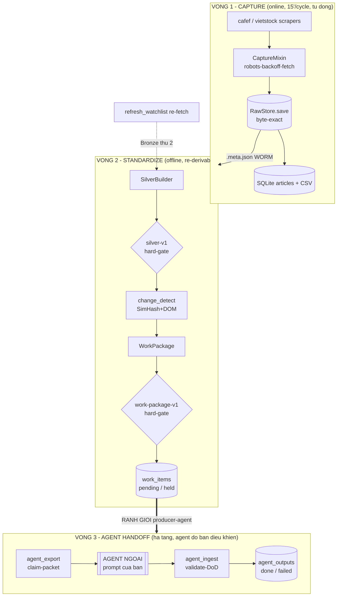
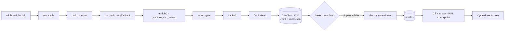
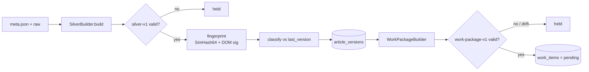
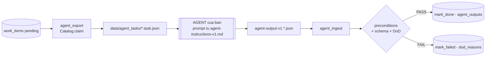

# Kiến trúc End-to-End — News-Scape Data Ingestion (3 vòng)

Cập nhật: 2026-08-17 · **Bản đồ cấp cao duy nhất** cho toàn quy trình từ scrape → agent.
Link tới design chi tiết (06–12) — không lặp nội dung. Đọc file này trước, rồi đi sâu từng doc.
(Kiến trúc ingestion Phase-1 gốc: [../ARCHITECTURE.md](../ARCHITECTURE.md).)

---

## 1. Triết lý kiến trúc

| Nguyên tắc | Diễn giải |
|-----------|-----------|
| **Medallion** | Bronze (raw WORM) → Silver (clean base) → Gold (agent output, hoãn). Mỗi tầng 1 hợp đồng. |
| **Producer ↔ Consumer** | Codebase = *producer* (chụp raw, chuẩn hoá, đóng gói). Agent = *consumer* (provider bất kỳ). Ranh giới = 2 JSON Schema. |
| **WORM** | Raw HTML ghi 1 lần, byte-exact, **không bao giờ sửa**. `content_sha256` = bằng chứng bất biến. |
| **Re-derivable** | Mọi thứ dưới Bronze là hàm THUẦN của Bronze → sửa parser/bump schema **không cần re-scrape**. |
| **Tách hot path** | Capture (nhanh, online) tách khỏi standardize (offline). Scraper không ghi DB downstream. |
| **Provider-agnostic** | Agent bị ràng buộc bởi hợp đồng (INPUT/OUTPUT/DoD), không khoá vendor/framework. |
| **Exactly-once** | Handoff idempotent (`UNIQUE(article_id, raw_sha256)`) + claim atomic (`BEGIN IMMEDIATE`). |

---

## 2. Toàn cảnh 3 vòng



---

## 3. VÒNG 1 — Capture (Bronze)

**Entry (prod):** `python -m src.morninger` (job `capture` mỗi 15'). Standalone/test:
`python -m src.orchestrator` hoặc `scripts/run_once.py` (1 cycle). Chỉ 1 scheduler được
chạy cùng lúc — advisory lock trong `pipeline_state` (Fix F).



- **Module:** `src/scrapers/{cafef,vietstock,capture_mixin}.py`, `src/crawler/{raw_store,robots,backoff,http_client}.py`.
- **Bất biến:** `RawStore.save` ghi raw **trước** mọi xử lý; atomic (`tmp`→`os.replace`); header whitelist; `images[]` scan chỉ-đọc.
- **✅ Done:** log `Cycle done` + Bronze mới + row `articles`. Chi tiết: [06-raw-html-capture](06-raw-html-capture.md).

---

## 4. VÒNG 2 — Standardize (Silver → catalog)

**Entry (prod):** `src.morninger` job `re-derive` (mỗi 30') → `pipeline.derive.rederive_incremental`
(tăng dần theo watermark `fetch_ts` trong `pipeline_state`). **Bảo trì / full-scan** (sau bump
schema hoặc sửa parser): `python scripts/rederive_from_bronze.py [domain] [date]`. Cả hai đều gọi
`src/pipeline/run.process_meta`.



**Change-detection — 5 trạng thái** (`src/pipeline/change_detect.py`):

| State | Điều kiện | Recommendation |
|-------|-----------|----------------|
| `NEW` | chưa có bản trước | re_extract |
| `UNCHANGED` | `content_sha256` trùng | skip |
| `CONTENT_CHANGED` | sha khác, DOM giữ nguyên | re_extract |
| `TEMPLATE_DRIFT` | `dom_path_sig` khác (cấu trúc đổi) | manual_review |
| `SELECTOR_BROKEN` | capture partial / thiếu node chính | manual_review |

- **Module:** `src/pipeline/{silver_builder,change_detect,run,refresh}.py`, `src/handoff/{work_package,contract_validator,catalog}.py`.
- **Điểm mới:** silver hard-gate + `extraction_quality` fallback chain + `refresh_watchlist` (cấp "lần chụp thứ 2" cho change-detect).
- **✅ Done:** `work_items` = `pending`. Chi tiết: [07-storage-layers-and-change-detection](07-storage-layers-and-change-detection.md), [08-handoff-contract-catalog](08-handoff-contract-catalog.md).

---

## 5. VÒNG 3 — Agent handoff (hạ tầng, không LLM tại producer)



**Taxonomy OUTPUT** (`agent-output-v1`): `summary`(tóm tắt) → `implication`(hàm ý) → `materiality`(mức độ quan trọng) + `confidence` + `citations` (CORE) · sentiment/event_type/entities+ticker (optional).

**Definition-of-Done** — `mark_done` ⇔ TẤT CẢ: ① schema PASS · ② `confidence ≥ 0.65` · ③ `≥2 citations` grounded ⊂ `cleaned_text` · ④ `extraction_quality ∈ {high,medium}` · ⑤ `processing_metadata` đủ.

- **Module:** `src/agent/{dod,packet,runner}.py`, `scripts/{agent_export,agent_ingest}.py`.
- **Ranh giới:** producer chỉ export/validate/nghiệm thu; agent (prompt của bạn) là hộp đen. Chi tiết: [09-agent-io-contract](09-agent-io-contract.md), [10-agent-orchestration-governance](10-agent-orchestration-governance.md), [12-agent-infrastructure](12-agent-infrastructure.md).

---

## 6. Bản đồ Artifact ↔ Schema ↔ Store ↔ Bất biến

| Artifact | Schema | Store | Owner | Bất biến |
|----------|--------|-------|-------|----------|
| Bronze raw | meta 14 keys (doc 06) | `data/raw_html/**` | producer | **WORM** |
| Silver | `silver-v1` | `data/silver/**` | producer | re-derive |
| Version log | DDL | `article_versions` | producer | append-only |
| Work-package | `work-package-v1` | `data/work_packages/**` | producer | re-derive |
| Catalog | DDL | `work_items` | shared | mutable status |
| Task-packet | packet 1.0 | `data/agent_tasks/**` | producer | ephemeral |
| Agent output | `agent-output-v1` | `agent_outputs` | agent | append, DoD-gated |
| Lifecycle/DoD | `task-lifecycle-v1` | — | agent | spec |

`hash = url_title_hash` = định danh bài xuyên mọi tầng. `content_sha256 = raw_sha256` = khoá provenance/change.

---

## 7. Catalog status ↔ vòng đời (không state mồ côi)

| `work_items.status` | Ý nghĩa |
|---------------------|---------|
| `pending` | đã enqueue, chưa claim |
| `claimed` | agent đang xử lý (STARTED/EXTRACTION/VERIFICATION) |
| `done` | DoD đạt → hoàn thành |
| `failed` | DoD không đạt (permanent) |
| `held` | precondition fail: silver/package invalid, TEMPLATE_DRIFT, SELECTOR_BROKEN → không giao agent |

---

## 8. Lịch vận hành hàng ngày

**Prod = 1 entrypoint duy nhất: `python -m src.morninger`** — 1 tiến trình, 3 job nội bộ
(advisory lock chống chạy trùng, Fix F). KHÔNG cần lên lịch job 2/3 riêng.

| Job (trong morninger) | Chu kỳ | Hàm gọi | Vòng |
|-----------------------|--------|---------|------|
| `capture` | 15' | `Orchestrator.run_cycle` | 1 |
| `re-derive` (incremental) | 30' | `pipeline.derive.rederive_incremental` | 2 |
| `drift report` | mỗi sáng (cron) | `pipeline.drift.list_drift` | giám sát |

Bổ trợ (chạy tay khi cần):

| Lệnh | Việc |
|------|------|
| `python -m src.orchestrator` | chỉ capture (fallback; morninger đã bao gồm) |
| `python scripts/rederive_from_bronze.py [domain] [date]` | **full-scan re-derive** — sau bump schema/sửa parser (BẢO TRÌ, không phải driver ngày) |
| `python scripts/refresh_watchlist.py [limit] [domain]` | kích hoạt change-detect (re-fetch watch-list) |
| `python scripts/report_drift.py` | drift on-demand |
| `agent_export.py` → agent → `agent_ingest.py` | Vòng 3 |
| `python scripts/validate_e2e.py` | smoke test toàn chuỗi |

---

## 9. Cấu trúc thư mục (rút gọn)

```
project/
├── src/
│   ├── morninger.py               # ⭐ PROD entrypoint: scheduler 3 job (capture+derive+drift)
│   ├── orchestrator.py            # Vòng 1 điều phối (dùng bởi morninger + standalone)
│   ├── scrapers/                  # cafef, vietstock, vneconomy, capture_mixin
│   ├── crawler/                   # raw_store, robots, backoff, http_client
│   ├── pipeline/                  # silver_builder, change_detect, run, derive, drift, refresh  <- Vòng 2
│   ├── handoff/                   # work_package, contract_validator, catalog     <- Vòng 2/3
│   ├── agent/                     # dod, packet, runner                           <- Vòng 3 (infra)
│   └── db/store.py                # SQLite: articles, article_versions, work_items, agent_outputs...
├── schemas/                       # silver-v1, work-package-v1, agent-output-v1, task-lifecycle-v1, agent-instructions-v1
├── scripts/                       # run_once, rederive_from_bronze, refresh_watchlist, report_drift,
│                                  #   validate_e2e, agent_export, agent_ingest
├── data/                          # raw_html(Bronze), silver, work_packages, agent_tasks, exports
└── docs/
    ├── ARCHITECTURE.md            # ingestion Phase-1 gốc
    ├── design/00-end-to-end-architecture.md   # <- file này (bản đồ 3 vòng)
    ├── design/06..12              # thiết kế chi tiết từng phần
    └── reference/                 # meta-schema.annotated, raw-html.annotated
```

---

## 10. Bất biến toàn hệ (checklist review)

1. Raw `.html` = byte-exact response; `sha256(file) == content_sha256`. Không bao giờ sửa.
2. Silver/package/version là hàm thuần của Bronze → re-derive giống hệt (KHÔNG dùng `now()`).
3. Package **trỏ** raw (`raw_sha256`), không inline bytes.
4. Mọi package qua producer đều PASS `contract_validator` mới `pending`; else `held`.
5. Agent verify `raw_sha256` trước khi xử lý (chống inject); output qua DoD mới `done`.
6. Handoff exactly-once: idempotent enqueue + atomic claim.
7. Change-detection cần ≥2 capture/URL — dùng `refresh_watchlist` cấp nguồn.

---

## 11. Governance & tài liệu liên quan

| Doc | Nội dung |
|-----|----------|
| [11 — master governance](11-e2e-standardization-governance.md) | điểm vào governance, layer↔contract↔owner |
| [06 — raw capture](06-raw-html-capture.md) | Bronze, meta 14 keys, no-clean |
| [07 — storage + change-detect](07-storage-layers-and-change-detection.md) | medallion, 5 state, refresh, hard-gate |
| [08 — handoff + catalog](08-handoff-contract-catalog.md) | work-package, exactly-once |
| [09 — agent I/O](09-agent-io-contract.md) | taxonomy OUTPUT, provider mapping |
| [10 — orchestration](10-agent-orchestration-governance.md) | roles, loops, DoD, guardrails |
| [12 — agent infra](12-agent-infrastructure.md) | export/ingest, DoD gate (không LLM) |
