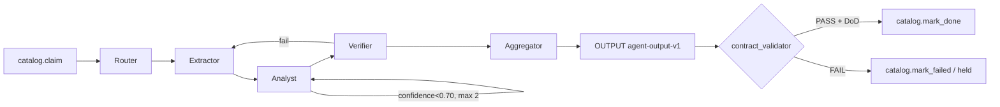
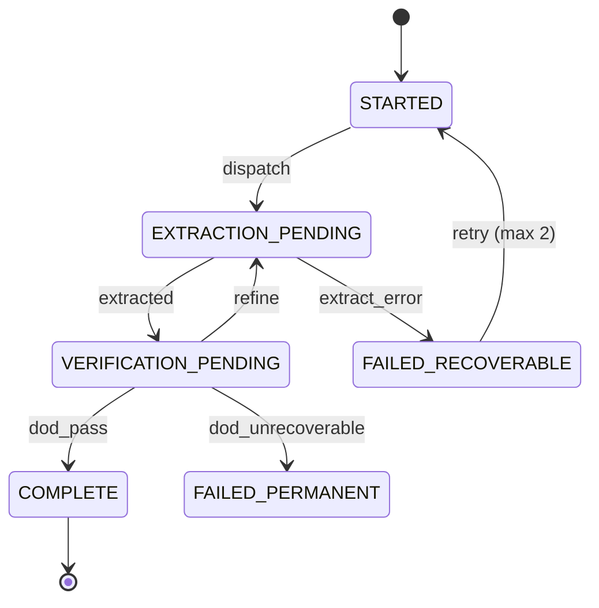

# Design 10 — Agent Orchestration & Governance [SPEC]

Cập nhật: 2026-08-14 · Trạng thái: **SPEC-ONLY** (docs + state machine; không code/LLM) · Kèm: [09](09-agent-io-contract.md), machine-readable: `schemas/task-lifecycle-v1.yaml`.

Khung để bất kỳ provider dựng lớp agent: thứ tự main/sub, vòng lặp, điều kiện thực thi, **điểm chạm
báo hiệu ĐÃ THỰC SỰ hoàn thành**. Phase-05. Provider-agnostic (roles ≠ vendor).

## 1. Vai trò (main → sub)
| # | Role | Loại | Nhiệm vụ |
|---|------|------|----------|
| 1 | **Router** | main | claim work_item từ catalog; phân loại bài; dispatch. Luôn đầu tiên. |
| 2 | **Extractor** | sub | đọc work-package; điền OUTPUT (summary/entities/event/sentiment). |
| 3 | **Analyst** | sub | làm giàu implication(hàm ý) + materiality(mức độ quan trọng). |
| 4 | **Verifier/Critic** | sub | schema-valid (hard) + groundedness/citation (LLM-judge, optional). |
| 5 | **Aggregator** | sub | dedupe cross-source, merge, finalize, `mark_done`. |

MVP tối thiểu (YAGNI): Router + Extractor + Verifier. Analyst/Aggregator optional.

## 2. Pipeline (deterministic backbone; agent gọi tại bước, control trả về flow)

## 3. Vòng lặp (explicit, BOUNDED — không autonomy vô hạn = guardrail)
| Loop | Trigger | Max |
|------|---------|-----|
| map-reduce | batch N bài → extractor song song → aggregator merge | — |
| iterative refine | `materiality.confidence < refine_threshold(0.70)` | 2 |
| adversarial verify | Critic: "implication overreach?" | 1 |

## 4. Task lifecycle (schemas/task-lifecycle-v1.yaml)

**Map catalog status:** STARTED/EXTRACTION_PENDING/VERIFICATION_PENDING/FAILED_RECOVERABLE→`claimed`;
COMPLETE→`done`; FAILED_PERMANENT→`failed`/`held`.

## 5. Definition-of-Done — "điểm chạm báo hiệu công việc ĐÃ THỰC SỰ hoàn thành"
`COMPLETE` **iff TẤT CẢ** (machine-checkable vs agent-output-v1):
1. OUTPUT PASS `contract_validator` (hard).
2. `confidence ≥ 0.65`.
3. `len(citations) ≥ 2`, mỗi `source_span ⊂ cleaned_text` (grounded).
4. `extraction_quality ∈ {high, medium}`.
5. `processing_metadata` đủ (provider, model, timestamp).
→ chỉ khi đó mới `catalog.mark_done`. Ngược lại `mark_failed`/`held` — KHÔNG bao giờ "done" thầm lặng.

## 6. Guardrails / preconditions
- change_state ∉ {SELECTOR_BROKEN, TEMPLATE_DRIFT} (else held).
- verify `raw_sha256` == sha256(read(raw_html_path)) trước khi xử lý (integrity chống inject).
- idempotency: cache theo (article_id, raw_sha256) → replay trả cached OUTPUT.
- bounded loops + timeout/task; không network/tool ngoài adapter khai báo.
- HITL: confidence>0.80 auto; 0.5–0.8 flag review; Critic quan ngại → người.

## 7. Provider-agnostic note
Roles/contracts/states độc lập LangGraph/CrewAI/MCP (đó là lựa chọn impl). Hợp đồng ràng buộc =
INPUT(work-package-v1) + OUTPUT(agent-output-v1) + DoD(task-lifecycle-v1) + guardrails. Đủ để dev bất
kỳ provider dựng lại không mơ hồ.

## Unresolved
- Failover đa provider, cost routing, verify citation quy mô lớn (researcher-02 Q). Triển khai khi lớp agent land.
