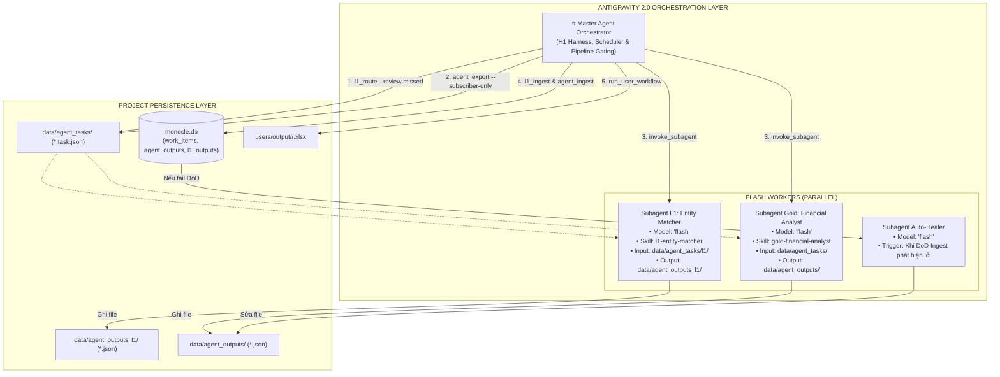

# Design 15 — Antigravity 2.0 Multi-Agent Hierarchy Orchestration

Cập nhật: 2026-08-24 · Trạng thái: **ACTIVE / PRODUCTION SPEC** · Kèm: [09](09-agent-io-contract.md), [10](10-agent-orchestration-governance.md), [13](13-per-user-output-workflow.md), [14](14-entity-system-and-mapping.md).

Đặc tả toàn diện về quy trình điều phối **Đa Đặc vụ (Multi-Agent Hierarchy)** chạy trên nền tảng **Antigravity 2.0**, sử dụng **100% model `flash`** cho toàn bộ các Subagent.

---

## 1. Mục tiêu & Nguyên lý Thiết kế Cốt lõi

1. **Ranh giới Phân công (Scripts vs Gold Agents)**:
   - **Scripts Automate**: Đảm nhiệm toàn bộ phần hạ tầng từ thu thập Bronze (raw_html bất biến), chuẩn hóa Silver, đóng gói task packets, kiểm tra cổng DoD Ingest và xuất Deliverable `<date>.xlsx`.
   - **Gold Agents (2 Lớp Nghiệp vụ Trí tuệ)**: Đảm nhận trọn vẹn cả **(1) Xác định Thực thể (Entity Recognition)** và **(2) Xử lý Nội dung & Ngữ nghĩa (Content Processing)**.
2. **Quy chuẩn Payload Đoạn văn Sạch (Clean Paragraph Payload Invariant)**:
   - Bản gốc raw_html được bảo toàn tại Bronze để audit/grounding.
   - Dữ liệu `cleaned_text` trong Task Packet chuyển giao cho Agent **BẮT BUỘC chỉ chứa các khối đoạn văn nội dung chính (Main Body Paragraphs: `
...
`)**, loại bỏ 100% rác thông tin (bài liên quan, tên tác giả vặt, quảng cáo, menu điều hướng) để Agent không bị nhận thông tin rác, tối ưu token burn và đảm bảo trích dẫn chuẩn xác.
3. **All-Flash Efficiency**: Toàn bộ các Subagent đều sử dụng model `flash` để đạt tốc độ xử lý nhanh (< 1s/bài), chi phí thấp, và tận dụng khả năng hiểu tiếng Việt tài chính xuất sắc.
4. **Cognitive Financial Intelligence**: Chấm điểm `materiality_score` biến thiên thực tế (0.1 - 1.0), phân loại `sentiment` (`positive`, `negative`, `neutral`), viết `implication` thực tế và trích xuất $\ge 2$ grounded citations $\ge 20$ ký tự.
5. **I/O Isolation & Guardrails**: Ràng buộc quyền hạn cứng theo `.agents/rules/01-subagent-guardrails.md` — Subagent chỉ đọc `data/agent_tasks/` và chỉ ghi `data/agent_outputs/`.
6. **Self-Healing Loop**: Cơ chế tự sửa lỗi tức thì khi phát hiện bài viết bị trượt Definition-of-Done (DoD).

---

## 2. Bản đồ Phân cấp Đặc vụ (Multi-Agent Hierarchy Map)

---

## 3. Quy trình Điều phối & Kiến trúc 5 Vòng (5-Ring Architecture)

Hệ thống vận hành theo nguyên lý phân quyền rạch ròi: **Code-first tất định (0 token) giải quyết phần lớn khối lượng; Subagent LLM chỉ kích hoạt cho bài toán nhận thức.**

1. **Vòng 1 (Bronze - Ingestion)**: Thu thập `raw_html` bất biến, audit hash sha256.
2. **Vòng 2 (Silver - Normalization & Deterministic L1)**: 
   - Parse khối đoạn văn sạch `
...
`, lưu `work-package`.
   - Chạy **L1 Code-First Router** (`entities.py`): Nhận diện thực thể bằng Regex Word Boundary và Morphological Compound Guard (`_blocked_by_morphology`). ~80% bài viết được gán nhãn ngay tại Vòng 2 với **0 token**.
3. **Vòng 3 (Gold Subscriber-Gated Export & Token Pruning)**:
   - **Subscriber-Gated Export** (`agent_export.py --subscriber-only`): Chỉ xuất task packet Gold cho các bài viết khớp với danh mục theo dõi của người dùng thực tế (`users/subscriptions/`). Bỏ qua 30–40% bài không ai theo dõi, tiết kiệm hàng triệu token mỗi ngày.
   - **Dynamic 3-Pass Semantic Pruner** (`pruner.py`): Giới hạn trần 2.200 ký tự (giảm 45% token BPE). Ưu tiên Sapo/Lead $\rightarrow$ Đoạn chứa `l1_entities` & số liệu tài chính $\rightarrow$ Giữ nguyên văn cấu trúc đoạn để bảo toàn trích dẫn $\ge 20$ ký tự.
4. **Vòng 4 (Subagent Cognitive Processing)**:
   - **Subagent L1**: Chỉ xử lý các bài `needs_agent` (tiêu đề chưa phân giải được ở Vòng 2).
   - **Subagent Gold**: Đọc payload 2.200 ký tự đã tỉa $\rightarrow$ Viết tóm tắt, suy luận hàm ý chuyên biệt, chấm điểm `materiality_score` (0.1 - 1.0), phân loại `sentiment`, trích dẫn $\ge 2$ citations $\ge 20$ ký tự $\rightarrow$ Ghi `data/agent_outputs/<article_id>.json`.
5. **Vòng 5 (Deliverables & Presentation)**:
   - Nghiệm thu DoD qua `agent_ingest.py`.
   - Xuất file báo cáo tài chính monochrome doanh nghiệp `users/output/<user>/<date>.xlsx`.

### Giai đoạn 3: Nghiệm thu DoD & Tự Phục Hồi (DoD Ingest & Self-Healing)
- Master Agent chạy `python scripts/l1_ingest.py` và `python scripts/agent_ingest.py`.
- **Điều kiện Đạt (DoD Pass)**:
  1. Khớp 100% JSON Schema (`l1-entity-output-v1` và `agent-output-v1`).
  2. $\ge 2$ trích dẫn `source_span` là chuỗi con nguyên văn của `cleaned_text` (độ dài $\ge 20$ ký tự).
  3. `extraction_quality ∈ {high, medium}`.
  4. Đầy đủ `processing_metadata`.
- **Nếu trượt DoD**: Gửi `dod_reasons` cho Subagent Flash để sửa trực tiếp file output và ingest lại.

### Giai đoạn 4: Biên dịch & Phân phối Người dùng (User Delivery)
- Master Agent chạy `python scripts/run_user_workflow.py`.
- Đối chiếu mã cổ phiếu bóc tách được với `users/subscriptions/` để ghi file:
  `users/output/<user>/<date>.xlsx`
- Header và dữ liệu chuẩn format, `key_points` xuống dòng gạch đầu dòng rõ ràng.
