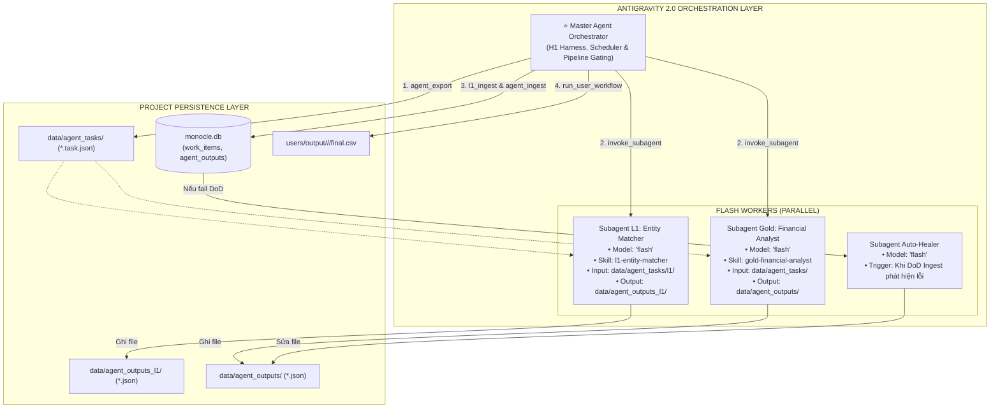

# Design 15 — Antigravity 2.0 Multi-Agent Hierarchy Orchestration

Cập nhật: 2026-08-24 · Trạng thái: **ACTIVE / PRODUCTION SPEC** · Kèm: [09](09-agent-io-contract.md), [10](10-agent-orchestration-governance.md), [13](13-per-user-output-workflow.md), [14](14-entity-system-and-mapping.md).

Đặc tả toàn diện về quy trình điều phối **Đa Đặc vụ (Multi-Agent Hierarchy)** chạy trên nền tảng **Antigravity 2.0**, sử dụng **100% model `flash`** cho toàn bộ các Subagent.

---

## 1. Mục tiêu & Nguyên lý Thiết kế

1. **All-Flash Efficiency**: Toàn bộ các Subagent đều sử dụng model `flash` để đạt tốc độ xử lý nhanh (< 1s/bài), chi phí thấp, và tận dụng khả năng hiểu tiếng Việt tài chính xuất sắc.
2. **Cognitive Financial Intelligence**: Chấm điểm `materiality_score` biến thiên thực tế (0.1 - 1.0), phân loại `sentiment` (`positive`, `negative`, `neutral`), viết `implication` thực tế và trích xuất $\ge 2$ grounded citations $\ge 20$ ký tự.
3. **I/O Isolation & Guardrails**: Ràng buộc quyền hạn cứng theo `.agents/rules/01-subagent-guardrails.md` — Subagent chỉ đọc `data/agent_tasks/` và chỉ ghi `data/agent_outputs/`.
4. **Self-Healing Loop**: Cơ chế tự sửa lỗi tức thì khi phát hiện bài viết bị trượt Definition-of-Done (DoD).

---

## 2. Bản đồ Phân cấp Đặc vụ (Multi-Agent Hierarchy Map)

---

## 3. Quy trình Điều phối 4 Giai đoạn

### Giai đoạn 1: Export Task Packets (Producer $\rightarrow$ Tasks)
- Master Agent chạy `python scripts/agent_export.py`.
- Các bài viết có trạng thái `pending` trong `work_items` được chuyển sang `claimed` và xuất thành:
  - `data/agent_tasks/l1/<article_id>.task.json`
  - `data/agent_tasks/<article_id>.task.json`

### Giai đoạn 2: Phân phối & Xử lý Song song (Subagent Dispatch)
- Master Agent gọi công cụ `invoke_subagent` khởi chạy song song 2 Subagent Flash:
  - **Subagent L1**: Quét tiêu đề $\rightarrow$ Đối chiếu `entities.json` $\rightarrow$ Ghi `data/agent_outputs_l1/<article_id>.json`.
  - **Subagent Gold**: Đọc toàn văn `cleaned_text` $\rightarrow$ Tóm tắt, suy luận hàm ý, chấm điểm `materiality_score` (0.1 - 1.0), phân loại `sentiment`, trích dẫn citations $\ge 20$ ký tự $\rightarrow$ Ghi `data/agent_outputs/<article_id>.json`.
- Master Agent tạm dừng, Antigravity tự động kích hoạt lại khi các Subagent hoàn thành (**Reactive Wakeup**).

### Giai đoạn 3: Nghiệm thu DoD & Tự Phục Hồi (DoD Ingest & Self-Healing)
- Master Agent chạy `python scripts/l1_ingest.py` và `python scripts/agent_ingest.py`.
- **Điều kiện Đạt (DoD Pass)**:
  1. Khớp 100% JSON Schema (`l1-entity-output-v1` và `agent-output-v1`).
  2. $\ge 2$ trích dẫn `source_span` là chuỗi con nguyên văn của `cleaned_text` (độ dài $\ge 20$ ký tự).
  3. `extraction_quality ∈ {high, medium}`.
  4. Đầy đủ `processing_metadata`.
- **Nếu trượt DoD**: Gửi `dod_reasons` cho Subagent Flash để sửa trực tiếp file output và ingest lại.

### Giai đoạn 4: Biên dịch & Phân phối Người dùng (User Delivery)
- Master Agent chạy `python scripts/run_user_workflow.py`.
- Đối chiếu mã cổ phiếu bóc tách được với `users/subscriptions/` để ghi file:
  `users/output/<user>/<date>/final.csv`
- Header và dữ liệu chuẩn format, `key_points` xuống dòng gạch đầu dòng rõ ràng.
