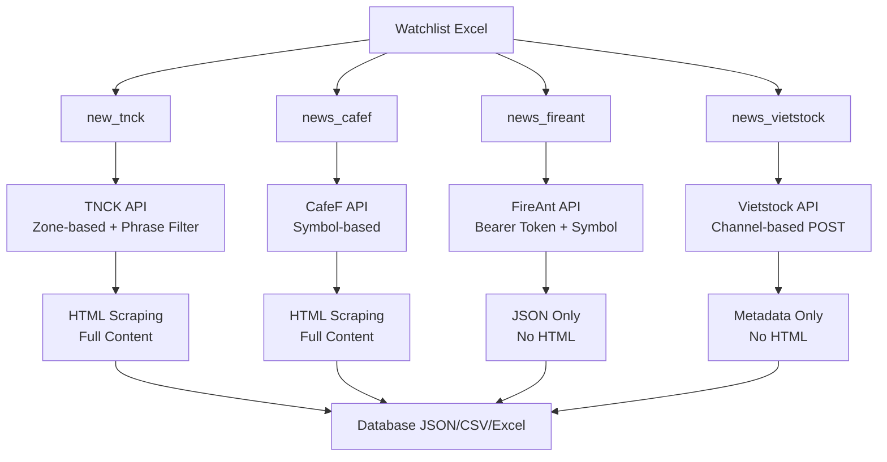

---

name: Giải thích logic API scraping

overview: ""

todos: []

---

  

# API Scraping - 4 trang tin

  

## Tổng quan kiến trúc

  

Cả 4 hệ thống đều tuân theo mô hình **INPUT → PROCESS → OUTPUT**, nhưng mỗi hệ thống có cách triển khai và đặc điểm API riêng:

  



  

---

  

## 1. NEW_TNCK (TinNhanhChungKhoan) - Chiến lược "Sniper"

  

### Đặc điểm API

  

**Endpoint Pattern:**

  

```

GET https://api.tinnhanhchungkhoan.vn/api/morenews-zone-{zone}-{page}.html

```

  

**Tham số đặc trưng:**

  

- `zone`: Category ID (4 = Thông tin doanh nghiệp)

- `page`: Số trang (bắt đầu từ 2, không phải 1)

- `phrase`: Mã cổ phiếu để lọc ngay tại server (QUAN TRỌNG)

  

### Logic hoạt động

  

#### Bước 1: Lấy Metadata từ API (Sniper Strategy)

  

```python

# File: new_tnck/tnck_scraper.py, dòng 59-121

def get_news_metadata_from_api(ticker, zone=4, page=2):

    api_url = f"{BASE_URL}/morenews-zone-{zone}-{page}.html"

    # ĐIỂM ĐẶC BIỆT: Dùng phrase parameter để lọc theo ticker NGAY TẠI SERVER

    params = {'phrase': ticker.upper()}

    response = requests.get(api_url, headers=headers, params=params)

    api_data = response.json()

    # Cấu trúc response: {"data": {"contents": [...]}}

    contents = api_data.get("data", {}).get("contents", [])

    return contents

```

  

**Điểm nổi bật:**

  

- ✅ **Lọc tại server**: API hỗ trợ `phrase` parameter → chỉ trả về tin liên quan đến ticker

- ✅ **Hiệu quả**: Không cần lọc client-side, giảm băng thông

- ✅ **Pagination**: Page bắt đầu từ 2 (không phải 1)

  

#### Bước 2: Trích xuất nội dung HTML đầy đủ

  

```python

# File: new_tnck/tnck_scraper.py, dòng 124-295

def extract_article_content(article_url, ticker):

    # Fetch HTML page

    response = requests.get(article_url, headers=headers)

    soup = BeautifulSoup(response.content, 'html.parser')

    # Trích xuất:

    # - Title: h1 hoặc meta og:title

    # - Sapo: div.sapo hoặc meta description

    # - Content: div.content (HTML nguyên bản)

    # - Tables: Tất cả thẻ <table>

    # - Paragraphs: Tất cả thẻ <p>

```

  

**Đặc điểm:**

  

- Lưu **HTML nguyên bản** (`content_html`)

- Trích xuất **text thuần** (`content_text`)

- Tách **paragraphs** và **tables** riêng

- Parse date từ nhiều format khác nhau

  

### Syntax và cấu trúc dữ liệu

  

**Input:**

  

```python

scrape_single_ticker(

    ticker='VNM',

    zone=4,           # Zone 4 = Thông tin doanh nghiệp

    max_pages=1,      # Lấy 1 trang (40 bài/trang)

    verbose=True

)

```

  

**Output Schema:**

  

```python

{

    'ticker': 'VNM',

    'source': 'TinNhanhChungKhoan',

    'url': 'https://www.tinnhanhchungkhoan.vn/...',

    'title': '...',

    'sapo': '...',

    'date': '2025-01-15T10:30:00',

    'date_iso': '2025-01-15T10:30:00',

    'author': '...',

    'content_html': '<div>...</div>',  # HTML nguyên bản

    'content_text': '...',              # Text thuần

    'paragraphs': ['...', '...'],       # List paragraphs

    'tables': [[...], [...]],           # List tables

    'api_metadata': {...}               # Metadata từ API

}

```

  

---

  

## 2. NEWS_CAFEF - API đơn giản, HTML scraping

  

### Đặc điểm API

  

**Endpoint:**

  

```

GET https://cafef.vn/du-lieu/Ajax/PageNew/News.ashx

```

  

**Tham số:**

  

- `symbol`: Mã cổ phiếu (lowercase)

- `NewsType`: 0 (tất cả loại tin)

- `pageIndex`: 1 (chỉ có 1 trang)

- `pageSize`: 200 (số bài tối đa)

  

### Logic hoạt động

  

#### Bước 1: Lấy danh sách từ API (một lần duy nhất)

  

```python

# File: news_cafef/cafef_scraper.py, dòng 48-85

def get_news_from_api(ticker, page_size=200):

    api_url = f"https://cafef.vn/du-lieu/Ajax/PageNew/News.ashx"

    params = {

        'symbol': ticker.lower(),  # ĐIỂM: lowercase

        'NewsType': 0,

        'pageIndex': 1,

        'pageSize': page_size      # Có thể lấy tới 200 bài/lần

    }

    response = requests.get(api_url, headers=headers)

    api_data = response.json()

    # Cấu trúc: {"Success": true, "Data": [...]}

    if api_data.get("Success") and api_data.get("Data"):

        return api_data["Data"]

```

  

**Đặc điểm:**

  

- ✅ **Không pagination**: Lấy tất cả trong 1 request (tối đa 200 bài)

- ✅ **Simple response**: Chỉ cần check `Success` và `Data`

- ✅ **Date format đặc biệt**: `/Date(timestamp+timezone)/` (cần parse riêng)

  

#### Bước 2: Parse Date đặc biệt

  

```python

# File: news_cafef/cafef_scraper.py, dòng 19-45

def parse_cafef_date(date_str):

    # Format: /Date(1738303980000+0700)/ hoặc /Date(1770597720000)/

    timestamp_part = date_str.split('(')[1].split(')')[0]

    timestamp_ms = int(timestamp_part.split('+')[0])  # Bỏ timezone

    return datetime.fromtimestamp(timestamp_ms / 1000)  # Convert ms → s

```

  

#### Bước 3: Trích xuất HTML đầy đủ

  

```python

# File: news_cafef/cafef_scraper.py, dòng 88-164

def extract_article_content(article_url, ticker):

    soup = BeautifulSoup(response.content, 'html.parser')

    # Selectors đặc trưng của CafeF:

    title = soup.find('h1', class_='title')

    subtitle = soup.find('h2', class_='sapo')

    publish_time = soup.find('span', class_='pdate')

    author = soup.find('p', style='text-align: right;')

    content = soup.find('div', id='mainContent')  # ĐIỂM: id='mainContent'

```

  

**Đặc điểm:**

  

- Selectors **cố định** và **rõ ràng** (class names, IDs)

- Delay **lớn hơn** (2-4 giây) để tránh bị block

- Lưu HTML nguyên bản + text + paragraphs + tables

  

### Syntax và cấu trúc dữ liệu

  

**Input:**

  

```python

scrape_single_ticker(

    ticker='HPG',

    page_size=200,    # Lấy tối đa 200 bài trong 1 request

    verbose=True

)

```

  

**Output Schema:**

  

```python

{

    'ticker': 'HPG',

    'source': 'CafeF',

    'url': 'https://cafef.vn/...',

    'title': '...',

    'subtitle': '...',              # ĐIỂM: có subtitle riêng

    'publish_time': '15/01/2025 10:30',

    'author': '...',

    'content_html': '<div id="mainContent">...</div>',

    'paragraphs': ['...', '...'],

    'tables': [[...], [...]],

    'date': '2025-01-15T10:30:00',  # ISO format

    'api_metadata': {

        'Title': '...',

        'LinkDetail': '/...',

        'DeployDate': '/Date(1738303980000+0700)/',  # Format gốc

        'NewsType': 0,

        'Summary': '...'

    }

}

```

  

---

  

## 3. NEWS_FIREANT - API với Bearer Token, JSON-only

  

### Đặc điểm API

  

**Endpoint:**

  

```

GET https://restv2.fireant.vn/posts

```

  

**Tham số:**

  

- `symbol`: Mã cổ phiếu

- `type`: 1 (loại bài viết)

- `page`: Số trang (1, 2, 3...)

- `pageSize`: 20 (cố định)

  

**Authentication:**

  

- **Bearer Token** (bắt buộc)

- Load từ `secrets.yaml`

  

### Logic hoạt động

  

#### Bước 1: Load cấu hình từ YAML

  

```python

# File: news_fireant/crawler.py, dòng 8-18

def load_extractors(file_path='extractors.yaml'):

    # Load cấu hình API endpoint, params, fields mapping

    return yaml.safe_load(f)

  

def load_secrets(file_path='secrets.yaml'):

    # Load bearer token

    return yaml.safe_load(f)

```

  

**Cấu trúc extractors.yaml:**

  

```yaml

sources:

  - id: fireant

    type: api_json

    endpoint: "https://restv2.fireant.vn/posts"

    method: GET

    params:

      symbol: "{{symbol}}"    # Placeholder được thay thế

      type: 1

      page: "{{page}}"

      pageSize: 20

    auth:

      type: bearer_token

      secret_key: fireant_token

    items_path: "$"           # Root array

    fields:                   # Mapping 67+ fields

      post_id: "postID"

      title: "title"

      content: "content"

      tagged_symbols: "taggedSymbols"  # Array of symbols

      ...

```

  

#### Bước 2: Fetch với Bearer Token

  

```python

# File: news_fireant/crawler.py, dòng 63-124

def fetch_api_data(source_config, secrets, params_override={}):

    # Build headers với Bearer Token

    headers = build_auth_headers(source_config, secrets)

    # → {"Authorization": "Bearer <token>"}

    # Replace placeholders trong params

    params = source_config.get("params", {}).copy()

    for key, value in params.items():

        if isinstance(value, str):

            # Thay {{symbol}} → "VNM", {{page}} → 1

            value = value.replace(f"{{{{{p_key}}}}}", str(p_value))

    # Make request

    response = requests.get(url, params=params, headers=headers)

    raw_data = response.json()

    # Extract items using JSONPath

    items_path_expr = jsonpath.parse(items_path)  # "$" = root

    items = [match.value for match in items_path_expr.find(raw_data)]

    # Map fields theo config

    for item in items:

        record = {}

        for field_name, path in source_config["fields"].items():

            record[field_name] = get_nested_value(item, path)

        extracted_data.append(record)

```

  

**Điểm nổi bật:**

  

- ✅ **JSONPath parsing**: Dùng `jsonpath_ng` để extract nested data

- ✅ **Field mapping**: Tự động map 67+ fields từ config

- ✅ **Nested access**: Hỗ trợ `user.name`, `taggedSymbols.0.symbol`

  

#### Bước 3: Xử lý Multiple Tickers

  

```python

# File: news_fireant/fireant_scraper.py, dòng 51-112

def process_fireant_item(item, primary_ticker=None, ticker_mode='first'):

    # Decode HTML entities

    for field in text_fields:

        item[field] = html.unescape(str(item[field]))

    # Tạo URL từ postID

    item['reference_url'] = f"https://fireant.vn/posts/{item['post_id']}"

    # Xử lý tagged_symbols (có thể có nhiều ticker)

    tagged_symbols = item.get('tagged_symbols')  # Array

    if ticker_mode == 'all':

        # Tạo nhiều row, mỗi row một ticker

        tickers = extract_ticker_from_tagged_symbols(tagged_symbols, mode='all')

        results = []

        for ticker in tickers:

            row = item.copy()

            row['ticker'] = ticker

            results.append(row)

        return results

    elif ticker_mode == 'concat':

        # Ghép tất cả ticker: "VNM, HPG, VIC"

        item['ticker'] = ', '.join(symbols)

    else:  # 'first'

        # Chỉ lấy ticker đầu tiên

        item['ticker'] = symbols[0] if symbols else primary_ticker

```

  

**Đặc điểm:**

  

- ✅ **Không scrape HTML**: Chỉ lấy JSON từ API

- ✅ **67+ fields**: Dữ liệu phong phú (engagement, sentiment, media...)

- ✅ **Multiple tickers**: Một bài có thể tag nhiều mã cổ phiếu

  

### Syntax và cấu trúc dữ liệu

  

**Input:**

  

```python

scrape_single_ticker(

    ticker='VIC',

    max_pages=3,           # 3 trang × 20 bài = 60 bài

    ticker_mode='first',   # 'first' | 'all' | 'concat'

    verbose=True

)

```

  

**Output Schema (67+ fields):**

  

```python

{

    'ticker': 'VIC',

    'source': 'FireAnt',

    'post_id': 123456,

    'reference_url': 'https://fireant.vn/posts/123456',

    'title': '...',

    'description': '...',

    'summary': '...',

    'content': '...',

    'date': '2025-01-15T10:30:00',

    'tagged_symbols': [{'symbol': 'VIC'}, {'symbol': 'HPG'}],  # Array

    'user_name': '...',

    'total_likes': 100,

    'total_replies': 50,

    'sentiment': 'positive',

    'has_image': True,

    'images': [...],

    # ... 50+ fields khác

}

```

  

---

  

## 4. NEWS_VIETSTOCK - POST API với Channel-based

  

### Đặc điểm API

  

**Endpoint Pattern:**

  

```

POST https://vietstock.vn/_Partials/{EndpointName}

```

  

**Đặc điểm:**

  

- ✅ **POST method** (không phải GET)

- ✅ **Channel-based**: Lọc theo channel_id (733 = Doanh nghiệp)

- ✅ **Headers quan trọng**: Phải có `X-Requested-With: XMLHttpRequest` để tránh 403

  

### Logic hoạt động

  

#### Kiến trúc INPUT → PROCESS → OUTPUT

  

```python

# File: news_vietstock/vietstock/extractor.py

class VietstockExtractor:

    def extract(self, input_params: Dict) -> List[Dict]:

        # INPUT: Validate với Pydantic

        input_model = VietstockInput(**input_params)

        # PROCESS: Fetch raw API data

        raw_data = fetch_data(input_model)

        # OUTPUT: Map và validate

        for item in items:

            mapped = map_item_to_schema(item, input_model.api_type)

            validate_output(mapped)  # Pydantic validation

            results.append(mapped)

```

  

#### Bước 1: INPUT - Validation với Pydantic

  

```python

# File: news_vietstock/vietstock/input.py, dòng 30-72

class VietstockInput(BaseModel):

    api_type: ApiType = "top_articles"  # Literal type

    channel_id: Optional[int] = 733    # 733 = Doanh nghiệp

    item: Optional[int] = 10            # Số bài viết

    top: Optional[int] = 10             # Cho top_stocks

    top_count: Optional[int] = 5         # Cho indices

    @validator("item")

    def validate_item(cls, v):

        if v < 1:

            raise ValueError("item must be >= 1")

        return v

```

  

**Điểm nổi bật:**

  

- ✅ **Type safety**: Dùng Pydantic để validate input

- ✅ **Literal types**: `api_type` chỉ chấp nhận giá trị định sẵn

- ✅ **Multiple API types**: 15+ loại API khác nhau

  

#### Bước 2: PROCESS - POST Request với Headers đặc biệt

  

```python

# File: news_vietstock/vietstock/process.py, dòng 24-90

def fetch_data(input_params: VietstockInput) -> Any:

    api_type = input_params.api_type

    if api_type == "top_articles":

        url = f"{BASE_URL}/TopPageArticle"

        # ĐIỂM: POST với data (không phải params)

        data = {

            "channelid": input_params.channel_id,  # 733

            "item": input_params.item              # 10

        }

        response = requests.post(url, data=data, headers=_headers(), timeout=15)

    elif api_type == "most_viewed":

        url = f"{BASE_URL}/MostViewedArticle"

        data = {"channelid": input_params.channel_id, "item": input_params.item}

        response = requests.post(url, data=data, headers=_headers())

    # ... 13+ API types khác

    return response.json()

  

def _headers():

    return {

        'User-Agent': 'Mozilla/5.0 ...',

        'X-Requested-With': 'XMLHttpRequest',  # QUAN TRỌNG: Tránh 403

        'Content-Type': 'application/x-www-form-urlencoded; charset=UTF-8',

        'Referer': 'https://vietstock.vn/doanh-nghiep.htm'

    }

```

  

**Đặc điểm:**

  

- ✅ **POST method**: Gửi data trong body (không phải query params)

- ✅ **Headers bắt buộc**: Thiếu `X-Requested-With` → 403 Forbidden

- ✅ **15+ endpoints**: Mỗi endpoint có logic riêng

  

#### Bước 3: OUTPUT - Map và Validate Sche